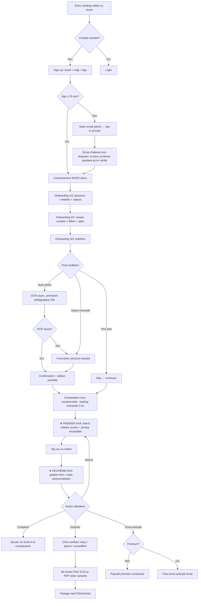
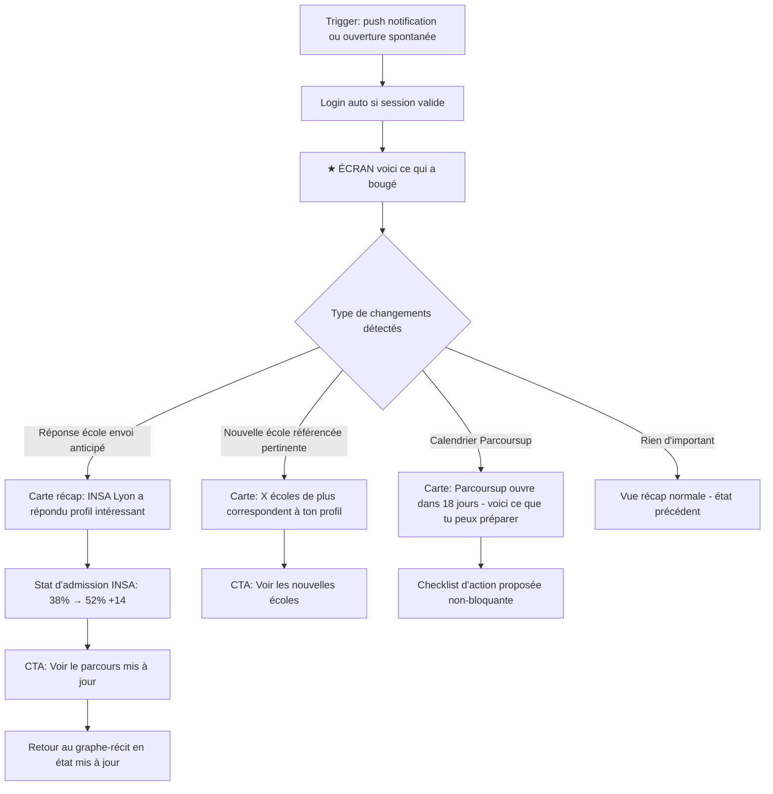
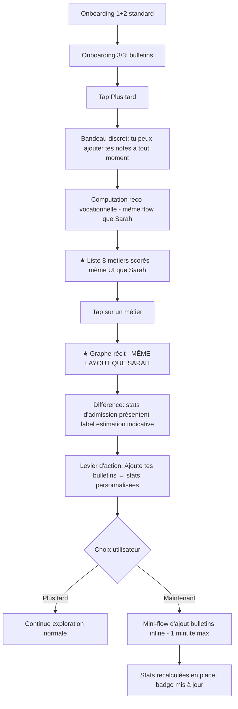
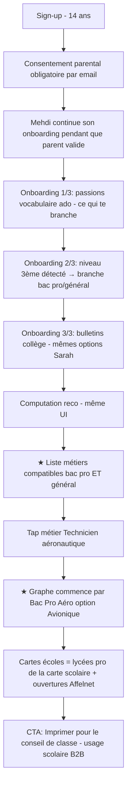
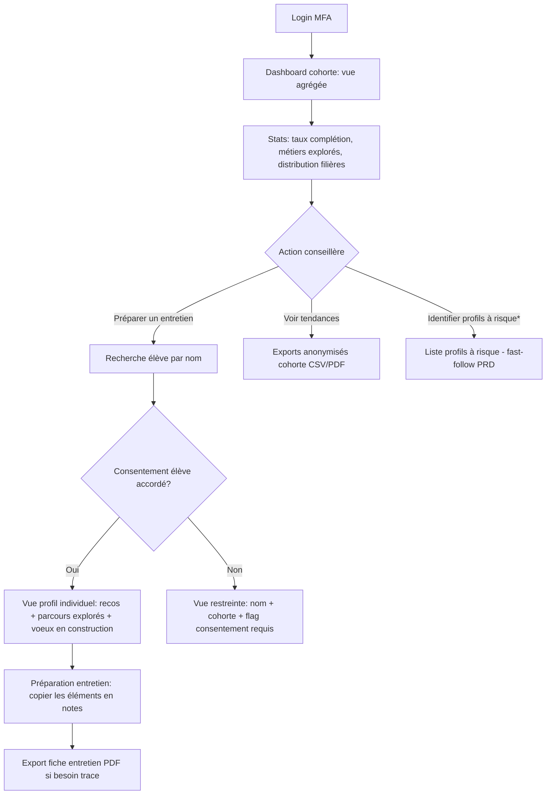
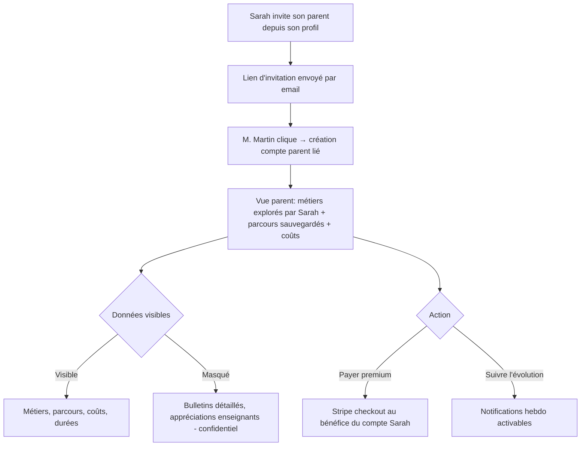
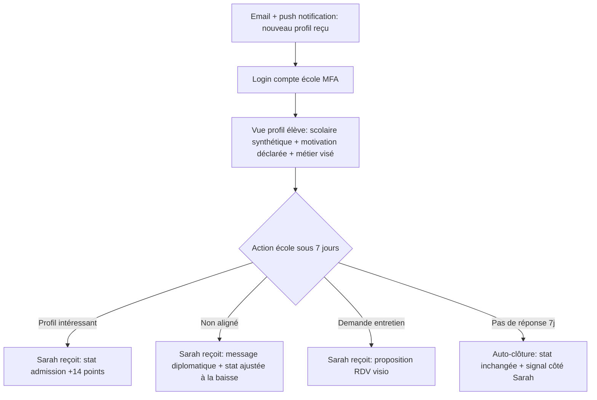

# UX Design Specification — Path-Advisor

**Author:** Marwen.bendhahbia
**Date:** 2026-05-13

---

## Project Understanding

### Vision

Path-Advisor transforme l'angoisse du choix Parcoursup en récit décisionnel défendable. Là où les outils existants livrent de l'information générique (Onisep, Diagoriente) ou de l'incitation commerciale biaisée (Diplomeo, L'Étudiant), Path-Advisor articule deux moments de vérité — *qui je peux devenir* et *comment y arriver, avec mes chances réelles* — dans une expérience continue, neutre commercialement, et fondée sur des données scolaires objectives.

**Type de produit MVP : décisionnel, pas éducatif.** Le MVP s'ancre sur le moment Parcoursup. L'expansion vers l'orientation découverte longue (collège, exposition métiers) est décidée pour une phase ultérieure.

**Job utilisateur dominant : narratif-défensif.** L'utilisateur n'embauche pas Path-Advisor pour *trouver le bon métier* — il l'embauche pour *avoir une histoire défendable à raconter* à sa mère, son groupe WhatsApp, sa prof principale. Toutes les décisions de design découlent de ce job.

### Target Users — Hiérarchie de design (3 tiroirs)

Six personas existent dans le PRD, mais ils n'ont pas tous le même statut de design. Cette hiérarchie est la boussole d'arbitrage de chaque écran.

**🎬 Protagoniste (1) — Sarah, Terminale (Parcoursup imminent)**
North Star design unique. Toutes ses frictions sont des bugs P0. Le MVP est construit *autour de son moment de vérité* : décider, comparer, défendre. Mobile-first, soir et bus. Aha #1 = comparer deux trajectoires concrètes en 90 s. Aha #2 = pré-validation sociale anticipée par une école ("est-ce qu'elle me prendrait ?"). Canal d'acquisition : TikTok / Instagram Reels saisonnier (déc–mars), profs principaux, SEO long-tail.

**🧪 Témoins (3) — Mehdi, Léa, Mme Dupont — droit de veto inclusion**
Pas de feature dédiée au MVP. Mais à chaque écran clé, ces trois posent la question d'inclusion qui peut faire rejeter le design.

- *Mehdi (3ème bac pro)* — garde-fou anti-stigma + plancher technique. Vocabulaire qui ne dit pas "filière d'excellence", "prépa", "mention". Si le ton humilie Mehdi, on refait.
- *Léa (sans bulletins)* — garde-fou *dignité*, pas positivité : le mode dégradé doit être visuellement indiscernable du mode normal. Si Léa se sent "cas spécial", on refait.
- *Mme Dupont (conseillère B2B)* — garde-fou *artefact de séance* : tout contenu produit pour Sarah doit pouvoir être imprimé, partagé en séance, archivé dans son dossier. Si rien n'est partageable, on refait.

**📦 Promesses (3) — M. Martin, Mme Garcia, Karim — V2/V3**
Documentés pour cohérence du pitch et préparation post-MVP. Aucune ligne de Figma avant product-market-fit MVP.

### Validation empirique des personas — Statuts 🟢🟡🔵

Aucune persona ne passe en design product avant validation terrain minimale. Statut à tenir à jour dans le document.

| Persona | Statut cible | Critère 🟢 |
|---|---|---|
| Sarah | 🟢 dans 3 semaines | 5 conversations réelles, 2 verbatim cités, 1 contradiction notée |
| Mme Dupont | 🟢 dans 6 semaines | 3 conseillères réelles interviewées |
| Mehdi | 🟡 hypothèse documentée | Sources : forums, associations partenaires, articles |
| Léa | 🔵 inclusion-only | Garde-fou permanent, pas de validation requise |
| M. Martin / Mme Garcia / Karim | 📦 hors scope MVP | — |

**Risque acté à mitiger explicitement** : Sarah-first peut reproduire les inégalités scolaires (Sarah a déjà 80 % du chemin fait par son environnement). Mitigation : Mehdi en 🔵 strict + partenariat associatif prévu post-MVP (AFEV, Article 1, Chemins d'Avenirs).

### Contraintes utilisateur concrètes (remplacent "mobile-first")

Performance budget et plancher technique fixés par les Témoins, pas par la Protagoniste :

- **Device plancher** : Android d'occasion à 150 €, écran fissuré, RAM 3 Go, forfait data 5 Go/mois. Tout ce qui ne marche pas dessus est cassé pour les Mehdi du produit.
- **Performance budget MVP** : Time-to-Interactive < 4 s sur 4G ; LCP mobile < 2,5 s (Core Web Vitals) ; aucun écran clé > 200 ko JS critique.
- **Heures et lieux d'usage** : Sarah le soir 21 h–23 h dans son lit (mobile) ; Mme Dupont 14 h–17 h écran 27" (desktop dashboard) ; Mehdi le soir et en transport (mobile bas-de-gamme).

### Key Design Challenges

1. **Explicabilité comme munition narrative**
   Chaque score doit produire une phrase courte que Sarah peut recopier dans WhatsApp pour défendre son choix. L'explicabilité n'est pas un défi de transparence technique — c'est un défi de *scénarisation*.

2. **Visualiser l'incertitude sans déstabiliser le récit défensif**
   Les fourchettes de stats d'admission doivent être *cadrées comme force du choix* ("voici tes 3 paris stratégiques avec leur niveau d'audace"), pas comme bruit statistique qui fragilise.

3. **Le moment "reco qui déçoit"**
   Quand Sarah voit "métier suggéré : aide-soignante" alors qu'elle visait avocate, elle ne doit pas fermer l'app. Design pattern explicite à concevoir : *recovery from disappointing recommendation* — la reco est une porte, pas un verdict.

4. **Traduction narrative multi-rôle (trois artefacts d'export)**
   La même reco doit produire **trois artefacts** : ado pour pairs (story Instagram, capture WhatsApp), parent pour famille (résumé défendable au repas), conseillère pour séance (fiche imprimable). Pas un écran adaptatif — trois artefacts distincts.

5. **Graphe de parcours interactif, accessible, mobile bas-de-gamme**
   Différenciateur critique : navigable au pouce sur Android 3 Go, alternative tabulaire RGAA AA, comparable entre 2-3 chemins, screenshotable (test : un chemin envoyé en WhatsApp sans légende reste-t-il compréhensible ?).

6. **Consentement parental comme design problem**
   Pas un workflow juridique : un design problem. Comment ne pas stigmatiser l'ado qui n'a pas de parent disponible / non-francophone / en conflit ? Mode dégradé familial à concevoir, alternative "consentement par tiers autorisé" (conseillère B2B, association).

7. **Design de la re-entrée**
   Sarah revient 3 mois plus tard. Quel écran l'accueille ? Quoi a bougé ? Comment voit-elle son évolution de profil et l'évolution des stats d'admission ? La continuité temporelle doit être designée comme une *séquence de rituels* aux moments-déclencheurs (rentrée, conseil de classe, Parcoursup J-30, résultats), pas une timeline lisse.

8. **Design de l'attente IA**
   Les 3 secondes de scoring sont une scène, pas un spinner. Quoi voir pendant qu'on charge ? Sur mobile bas-de-gamme l'attente peut monter à 5-6 s — à designer comme un moment, pas un défaut.

9. **OCR bulletins avec fallback gracieux**
   La saisie manuelle ne doit pas être un échec. UX à concevoir : "pas grave, on fonctionne aussi sans — voici ce que les bulletins apporteront en plus quand tu les ajouteras".

10. **Timing & déclencheur social**
    Le job de Sarah en septembre ≠ novembre ≠ janvier post-Parcoursup ≠ mai. Le produit doit être *atemporellement utile* mais *contextuellement pertinent* — déclencheurs et notifications calés sur le calendrier réel.

11. **Triple contrainte technique** mobile-bas-de-gamme + RGAA AA + SEO indexable, sur les composants les plus complexes (graphe, dashboard).

### Design Opportunities

1. **Continuité temporelle comme moat défensif**
   *Seul actif robuste à la pression LLM grand public horizon 2027.* Quatre ans de bulletins, doutes, itérations versionnés = un graphe de trajectoire qu'un LLM ne peut pas générer à la demande. La continuité doit se *voir* dans l'UI : ligne de vie personnelle, versions du profil, "ce que tu pensais en novembre vs aujourd'hui".

2. **Le graphe-récit racontable**
   Le graphe de parcours n'est pas un diagramme technique : c'est un *objet social partageable*. Test décisif : Sarah screenshote un chemin et l'envoie à sa mère sans légende — est-ce compréhensible ? Si oui, c'est une opportunité. Sinon, c'est un produit qui se regarde.

3. **Le job de l'export**
   Trois artefacts partageables par rôle (ado→pairs, parent→famille, conseiller→séance). Aucun concurrent ne traite l'export comme un first-class citizen produit. À concevoir comme des "trophées défendables", pas des PDF.

4. **Pré-validation sociale anticipée**
   L'envoi anticipé crée un nouveau moment d'orientation : *l'école a répondu*. Le vrai job n'est pas la fraîcheur statistique mais la réduction d'incertitude binaire (oui / non / peut-être). À designer comme un événement, pas une donnée.

5. **Neutralité comme propriété émergente de l'UI**
   Pas un trustmark visuel ("aucune école ne nous paie") : une propriété qui se *prouve* à chaque micro-interaction — ordre de présentation des écoles, refus du CTA sponsorisé, critères de tri visibles, méthodologie auditable accessible en 2 clics depuis n'importe quelle reco.

6. **Mode normal = mode dégradé**
   Le mode "sans bulletins" n'est pas une expérience dégradée, c'est *le mode normal d'entrée* — les bulletins enrichissent progressivement mais ne sont jamais un préalable visuel. Léa et Sarah voient le même écran d'accueil ; ce sont les *contenus internes* qui se densifient.

### Risques produit sous radar (à mitiger en design system)

- **Reproduction des inégalités scolaires** — Sarah-first sans Mehdi-comme-Témoin strict = produit pour cadres. Mitigation par garde-fou inclusion sur chaque écran + partenariat associatif post-MVP.
- **Désintermédiation par LLMs grand public d'ici 2027** — fenêtre effective ~24 mois sur l'argument neutralité. Moat à construire prioritairement = continuité temporelle versionnée. Sans cela, Path-Advisor est rattrapable par un LLM grand public + Onisep open data.
- **Pivot business latent** — la question "qui signe le chèque" (parent / établissement / élève) reste différée. Si le B2C premium ne convertit pas à 5 % d'ici la fin MVP, pivot vers infrastructure institutionnelle B2B2C à considérer (impact UX majeur : onboarding par l'école, validation parentale, dashboard prof principal).
- **Personas en carton-pâte** — validation terrain en work stream parallèle obligatoire : 5 entretiens Sarah en 3 semaines, 3 entretiens Mme Dupont en 6 semaines, avant que le design system MVP soit gelé.

## Core User Experience

### Defining Experience

**Promesse en une phrase :** en moins de 12 minutes, Sarah passe d'un brouillard angoissant à un récit défendable qu'elle peut envoyer dans WhatsApp à 23 h.

**Boucle d'expérience cœur :**

1. Déclarer quelques signaux (passions, niveau, bulletins)
2. Recevoir 8 métiers scorés avec **phrase explicative recopiable**
3. Cliquer sur un métier → graphe de 2-3 trajectoires
4. Comparer 2 écoles avec stats personnalisées
5. Exporter / partager / déclencher envoi anticipé
6. Revenir 3 mois plus tard, voir ce qui a bougé

**Verbe central : consulter, comparer, partager.** Pas "compléter son profil" (one-shot), pas "envoyer anticipé" (rare). C'est ce que Sarah fera 10-30 fois entre novembre et mars.

**Le moment unique à ne pas rater :** la première vue des recos. Doit produire à la fois **confiance** (pourquoi ce métier) et **propriété narrative** (quoi dire à ma mère).

### Platform Strategy

- **Web responsive PWA** — pas d'app native MVP, installable pour ressembler à une app sans double codebase.
- **Mobile-first sur Sarah** (Protagoniste), **desktop-priority sur Dupont** (dashboard B2B, écran 27").
- **Touch primaire** côté élève ; **raccourcis clavier** côté conseillère (1600 dossiers à naviguer rapidement).
- **Offline limité** : cache offline-first sur pages déjà visitées (Sarah dans le métro), pas de mode hors-ligne complet.
- **Capacités device** : caméra (scan bulletin par photo), push web (rappels Parcoursup), partage natif iOS/Android (export WhatsApp / Story Instagram).
- **Performance budget** (cf Step 2) : Android 3 Go RAM, TTI < 4 s sur 4G, < 200 ko JS critique par écran.

### Effortless Interactions

**Zéro effort cognitif (interactions qui doivent se faire sans réfléchir) :**

- **Importer un bulletin** → prise photo, ça marche. Pas de redressement manuel ni d'étape "êtes-vous sûr ?".
- **Comprendre un score** → la phrase explicative est sous le 78 %, lisible en 2 s sans tap.
- **Comparer deux écoles** → 2 taps, pas un wizard de comparaison.
- **Partager un parcours** → 1 tap, menu natif (WhatsApp, Story Insta, mail).
- **Revenir après absence** → zéro re-onboarding, écran d'accueil = "voilà ce qui a bougé".
- **Mode dégradé invisible** → Léa et Sarah voient le même écran d'accueil ; ce sont les contenus internes qui se densifient.

**Automatique, sans intervention utilisateur :**

- Détection du niveau scolaire (3ème / lycée général / lycée pro) selon les bulletins importés.
- Mise à jour des stats d'admission après réponse école (< 5 min, cf NFR-P5).
- Notifications calées sur calendrier Parcoursup (J-30, ouverture vœux, résultats…).
- Sauvegarde continue — aucun bouton "enregistrer" dans le produit.

### Critical Success Moments

| Moment | Make (succès) | Break (échec) |
|---|---|---|
| **Premier écran de recos** | Sarah reconnaît 1 métier qu'elle visait + découvre 1 métier inattendu et plausible → confiance | Tous les métiers semblent génériques ou décalés → ferme l'app |
| **Premier clic "voir le parcours"** | Graphe se construit à l'écran avec chances réelles → "ah, c'est concret" | Diagramme statique illisible → confusion |
| **Première stat d'admission** | Fourchette présentée comme stratégie ("38 % à INSA = pari audacieux") | Pourcentage sec démoralise ou semble inventé |
| **Première reco décevante** | Cadrée comme porte ("explore d'abord") → exploration | Cadrée comme verdict → fermeture définitive |
| **Premier export** | Capture WhatsApp lisible sans légende → viralité organique | Capture moche → gêne à partager |
| **Retour à J+30** | "Voilà ce qui a bougé" → sentiment de compagnonnage | Page vide ou re-onboarding → désengagement |

**First-time user success :** Sarah complète son profil, voit 8 métiers, ouvre 1 graphe, screenshote 1 parcours — en moins de 15 minutes total. Si elle fait cela à sa première session, elle revient.

### Experience Principles

Cinq principes opérationnels qui tranchent tous les arbitrages UX à venir.

1. **Toute reco produit une phrase recopiable.**
   Pas de score sans verbalisation explicable en une ligne. Si un écran montre un nombre sans le dire avec des mots qui se partagent, il est cassé.

2. **L'incertitude est une stratégie, pas un bruit.**
   Les fourchettes de stats d'admission se présentent comme des paris ("audacieux / réaliste / sûr"), jamais comme du doute statistique brut qui fragilise le récit défensif.

3. **Trois artefacts, pas un écran.**
   Chaque parcours, chaque reco, chaque stat doit pouvoir s'exporter en trois formes : story ado, résumé parent, fiche conseillère. L'export est first-class citizen produit, pas une feature de menu.

4. **Le mode normal contient tous les modes.**
   Pas de version dégradée affichée, pas de version premium éclatante. Un seul shell visuel ; les contenus internes se densifient selon le profil. Léa et Sarah voient le même écran d'accueil.

5. **Chaque session commence où la précédente s'est arrêtée.**
   Aucun re-onboarding, aucune validation rétroactive. Le produit se souvient avec dignité. La continuité temporelle est visible à chaque ouverture.

## Desired Emotional Response

### Primary Emotional Goals

**Objectif émotionnel central pour Sarah (Protagoniste) :**

Passer de **l'anxiété diffuse** (brouillard, jugement social, pression Parcoursup) à une **confiance défendable et calibrée**. Pas l'euphorie ("j'ai trouvé ma passion !"), pas la certitude absolue ("c'est ÇA"). Sarah ferme l'app en pensant : *"J'ai un cap que je peux tenir. Je sais quoi dire à ma mère. Le monde a un peu plus de sens qu'il y a 12 minutes."*

**Émotions secondaires (par ordre d'importance) :**

| Émotion | Pour qui en priorité | Signe que c'est réussi |
|---|---|---|
| **Dignité** | Léa, Mehdi (Témoins) | L'utilisateur ne se sent jamais "cas spécial" ou "à corriger" |
| **Agentivité** | Sarah | "C'est moi qui décide ; l'app m'éclaire, elle ne décide pas pour moi" |
| **Compagnonnage** | Sarah au retour | "L'app me retrouve, elle se souvient, je ne repars pas de zéro" |
| **Légèreté** | Sarah sous pression | Le poids du choix s'allège — pas l'enjeu, le poids cognitif |
| **Confiance neutralité** | Sarah, parents | "Ça ne me vend rien — c'est différent de Diplomeo" |

**Émotions à bannir :**

- 🚫 **Verdict-fatigue** — sensation que l'algorithme me juge / me classe
- 🚫 **Stigmate** — "version dégradée", "profil incomplet", "tu manques de X"
- 🚫 **Euphorie creuse** — célébration qui retombe en doute 12 h après
- 🚫 **Chaleur de vendeur** — copywriting trop chaleureux (rappelle Diplomeo)
- 🚫 **Condescendance** — ton qui traite l'ado comme un enfant à protéger
- 🚫 **Amplification d'anxiété** — urgence fabriquée ("⏰ Plus que 12 jours !!")

### Emotional Journey Mapping

Émotions cibles à chaque moment-clé de l'arc Sarah :

| Moment | État émotionnel d'entrée (probable) | État émotionnel cible (à produire) |
|---|---|---|
| **Découverte** (TikTok / pair / prof principal) | Méfiance fatiguée ("encore un truc") | Curiosité prudente — "tiens, c'est peut-être différent" |
| **Onboarding** (passions + bulletins) | Friction redoutée | Sentiment de sérieux — "ils me prennent comme adulte" |
| **Premier écran de recos** | Attente nerveuse | **Reconnaissance + surprise calibrée** — "oui ce métier me ressemble" + "ah ça je n'avais pas pensé" |
| **Reco décevante** | Risque de blessure ("aide-soignante alors que je voulais avocate") | **Légitimation du doute** — "ceci est une porte, pas un verdict, je peux explorer" |
| **Graphe de parcours + stats** | Inquiétude des chiffres | **Clarté stratégique** — "je vois l'échiquier, j'ai des paris à faire" |
| **Export / partage** | Hésitation ("est-ce assumable ?") | **Agentivité + propriété** — "j'ai construit ça, je peux le montrer" |
| **Réponse école (envoi anticipé)** | Suspense | **Validation OU recalibration *digne*** — la réponse négative n'humilie pas |
| **Retour à J+30** | Hésitation à rouvrir | **Continuité + reconnaissance** — "voici ce qui a bougé" |
| **Échecs gracieux** (OCR rate, pas de bulletins, pas de parent) | Honte potentielle | **Dignité préservée** — "tu fais ce que tu peux, on continue normalement" |

### Micro-Emotions

Les arbitrages fins que tout écran doit gagner :

| À gagner | Contre |
|---|---|
| Confiance | Scepticisme (héritage Diplomeo / Onisep) |
| Agentivité | Passivité ("l'algo a décidé pour moi") |
| Reconnaissance | Anonymat ("tu es un profil parmi N") |
| Dignité | Pitié ("on fait avec ce qu'on a !") |
| Excitation calibrée | Euphorie performative (confettis) |
| Confiance stratégique | Certitude absolue (sur-promesse) |
| Sérénité datée ("on a le temps de bien faire") | Urgence fabriquée |

### Design Implications

Connecter émotion → choix UX concret :

| Émotion cible | Choix UX qui la produit |
|---|---|
| **Confiance défendable** | Chaque score est accompagné d'une *phrase recopiable* ; le nombre n'est jamais la headline, l'explication l'est |
| **Dignité Léa / Mehdi** | Mode normal = mode dégradé (zéro marqueur visuel "profil incomplet") ; vocabulaire qui ne stratifie pas ("filière d'excellence" banni) |
| **Confiance neutralité** | Aucun CTA sponsorisé ; ordre de présentation des écoles auditable ; méthodologie accessible en 2 clics |
| **Agentivité** | L'utilisateur contrôle *quoi* exporter, *à qui*, *quand* — rien n'est auto-partagé |
| **Compagnonnage** | État préservé inter-sessions, jamais de re-onboarding, écran d'accueil = "voilà ce qui a bougé" |
| **Légèreté** | Loading states scénarisés (mini-récit court), pas spinners ; copy court ; whitespace généreux |
| **Excitation bornée** | Pas de confettis, pas de "🎉" sur "profil 100 %" ; surprise réservée aux *vrais* aha (métier inattendu, réponse école, parcours débloqué) |
| **Anxiété acknowledgée, jamais amplifiée** | Le produit ne dit jamais "URGENT", mais ne nie pas le calendrier ("Parcoursup ouvre dans 18 jours — voici ce que tu peux préparer d'ici là") |
| **Recovery de la déception** | La reco décevante ouvre toujours sur "voici 3 chemins voisins à explorer" + "pourquoi cette reco a baissé en score" — jamais sur "désolé" |
| **Légitimité du doute** | Les fourchettes de stats sont présentées comme *paris* ("audacieux / réaliste / sûr"), pas comme bruit ; *incertitude = terrain de jeu, pas faiblesse* |

### Emotional Design Principles

Cinq principes qui tranchent les arbitrages émotionnels à venir.

1. **La confiance est calibrée, jamais euphorique.**
   Pas de confettis, pas de "tu as trouvé !". Juste des prises de position claires et défendables. Sarah doit pouvoir tenir son cap dans 3 mois — pas planer 24 h.

2. **Dignité avant positivité.**
   Ne jamais dire à Léa "on fait ce qu'on peut, c'est super !". Juste faire normalement avec ce qu'elle donne. La positivité explicite trahit la stigmate cachée.

3. **Le produit est neutre. Toujours.**
   Pas de chaleur de vendeur, pas de copywriting "tu vas adorer !". Ton : grand frère ou grande sœur de confiance, pas coach personnel. La neutralité commerciale s'entend dans la voix.

4. **L'excitation est réservée aux ahas, pas aux étapes.**
   Aucune célébration sur "profil 50 % complété" ou "tu as débloqué cet écran". La surprise est rare et précieuse : le métier inattendu, la réponse école, le parcours qui s'ouvre.

5. **L'anxiété est reconnue, jamais amplifiée.**
   Le produit ne crie pas "URGENT". Mais il ne fait pas semblant que le calendrier n'existe pas. Posture : *"Voici où on en est. Voici ce que tu peux préparer."* Jamais *"DERNIÈRE CHANCE."*

## UX Pattern Analysis & Inspiration

Panel d'inspiration validé : Strava, Doctolib (angle fiche praticien, pas booking flow), Spotify Wrapped, Revolut, Niche.com (à investiguer en mini-audit).

### Inspiring Products Analysis

#### 1. Strava — Carte récap partageable

**Ce qu'ils font très bien.** Transformer une activité privée en **artefact défendable et partageable** (route + temps + statut social discret). Densité d'info lisible en un coup d'œil. "Year in Sport" — rituel annuel qui crée de l'attente sans gamification creuse.

**Patterns transférables**

- Carte récap post-action (carte du parcours + 4-5 stats) = analogue direct pour la **carte de parcours** et la **carte de proba école** : screenshot-first, lisible en 3 s
- Format ratio 9:16 pour share natif (story Insta, statut WhatsApp)
- Achievements rares et non-vantards (contre-exemple à étudier pour le retour J+30)

**Adaptation Path-Advisor**

- Écran "voilà mes 3 paris stratégiques pour Parcoursup" = format Strava-style, dense mais aéré, capturable en une image
- Récap fin de Terminale post-Parcoursup = équivalent "Strava Wrapped"

#### 2. Doctolib (mobile) — Densité d'information sur fiche

**Ce qu'ils font très bien.** La page de résultats de recherche praticien est **dense sans être bruyante** : hiérarchie carte = nom + spécialité + photo, puis distance, prochain RDV, statut (conventionné, langues, accessibilité). Filtres au-dessus, résultats en dessous, **aucune injection publicitaire**. Le ton est neutre, pro, jamais vendeur.

**Patterns transférables**

- Hiérarchie typographique de la fiche praticien → directement applicable à la **fiche métier** et la **fiche école/formation** : titre, qualification, métadonnées scannables (durée, coût, sélectivité, débouchés, dates Parcoursup, distance géographique)
- Filtres persistants en haut + résultats grille mobile → notre liste de métiers / liste d'écoles
- Métadonnées sous forme de pills (langues, conventionné, accessibilité) → pour nos métadonnées école (alternance possible, internat, proximité, sélectivité)
- Refus du CTA sponsorisé — c'est *exactement* notre promesse neutralité

**Adaptation Path-Advisor**

- La fiche école/formation hérite *visuellement* du code Doctolib mais avec une métadonnée propre : la **stat d'admission personnalisée** affichée au même niveau hiérarchique que "prochain RDV" chez Doctolib
- La fiche métier suit le même code : journée type, débouchés, revenu médian, prérequis scolaires

#### 3. Spotify Wrapped — Narrative scrollytelling exportable

**Ce qu'ils font très bien.** Transformer des données analytics en **récit scrollable** que l'utilisateur *veut* partager. Un insight par slide, un chiffre par slide. Format vertical natif. Rituel annuel qui crée de l'anticipation calibrée — sans urgence fabriquée.

**Patterns transférables**

- Un insight par écran — anti-pattern UI dense, ici on assume la respiration
- Format vertical 9:16 premier, optimisé pour capture native
- Pas de tableau de bord, un récit — Spotify aurait pu faire un dashboard, ils ont choisi un *film*
- Anticipation par moment-déclencheur saisonnier — chez nous : J-30 Parcoursup, ouverture vœux, résultats

**Adaptation Path-Advisor**

- Le format "story ado" des trois artefacts d'export (cf principe #3 Step 4) suit cette grammaire Spotify Wrapped : 5-8 slides verticales, un chiffre par slide, share natif en un tap
- Le récap "voici ce qui a bougé depuis ta dernière visite" (retour J+30) emprunte le ton — un récit court, pas une page de logs

#### 4. Revolut — Confiance par la transparence

**Ce qu'ils font très bien.** Confiance financière par clarté extrême. Chaque chiffre est accompagné de son contexte (taux marché, frais, fréquence). Refus complet du copywriting chaleureux. UI sobre, whitespace généreux, sensation "premium" sans pousser à l'upsell.

**Patterns transférables**

- Chiffre + contexte systématique — jamais un nombre nu, toujours sa comparaison ou son cadrage qualitatif
- Un bouton primaire par écran maximum
- Pas de bannière promo, pas d'upsell agressif — l'app vend en *montrant la valeur*, pas en l'écrivant
- Calibration explicite des incertitudes ("estimation", "indicatif", "marché actuel")
- Ton sobre, anti-coach

**Adaptation Path-Advisor**

- L'écran "ta proba d'admission" suit *littéralement* le code Revolut : stat principale en gros + contexte ("moyenne admise dernière promo : X", "ta zone : pari audacieux"), un levier d'action ("+2 points en maths → 58 %"), zéro confetti
- Le ton des notifications calendrier Parcoursup hérite de la sobriété Revolut

#### 5. Niche.com — Concurrent direct US à investiguer

**Ce qu'on doit étudier.** Ils font littéralement *notre* job sur le marché US — "fit score" personnalisé par université, reviews intégrées, comparaison côte à côte, méthodologie publiée. **À étudier en mode benchmark** avant tout choix de design.

**Points d'attention**

- Risque de pollution commerciale : Niche vend des "Profile Upgrades" aux écoles, ce qui a écorné leur image neutralité aux US. À étudier comment ils l'ont géré (ou raté) pour anticiper notre propre risque.
- Pattern "fit score" = notre proba personnalisée. Comment l'affichent-ils ? Quelles features visibles, lesquelles cachées ? Quel cadrage qualitatif ?

**Action concrète recommandée**

Mini-audit Niche.com de 2 h avant Step 8 (Visual Foundation) : 10 screenshots clés annotés, ce qu'on adopte / adapte / refuse.

### Transferable UX Patterns (synthèse cross-products)

Trois grands patterns émergent du panel :

| Pattern | Sources | Application Path-Advisor |
|---|---|---|
| **La carte récap dense et capturable** | Strava, Doctolib | Fiche métier, fiche école, carte parcours, carte proba admission |
| **Le chiffre toujours avec son contexte** | Revolut, Strava | Tous les scores (vocationnels + admission), toutes les fourchettes |
| **Le scrollytelling vertical avec un insight par écran** | Spotify Wrapped | Artefacts d'export (story ado), récap retour J+30, futur "Path Wrapped" annuel |

### Anti-Patterns to Avoid

| Anti-pattern | Source | Pourquoi à bannir |
|---|---|---|
| **CTA sponsorisé / "écoles partenaires" mis en avant** | Diplomeo, L'Étudiant | Casse la promesse neutralité — différenciation centrale du produit |
| **Fiches statiques 2015** | Onisep | Anti-modèle de la continuité temporelle et de la fraîcheur |
| **Urgence fabriquée ("⏰ DERNIÈRE CHANCE")** | Parcoursup, marketing EdTech | Amplifie l'anxiété — viole principe émotionnel #5 |
| **Scores de complétude "73 % de ton profil"** | LinkedIn, Studyrama | Crée stigmate sur Léa (Témoin), pression performative |
| **Confettis / célébrations creuses** | Duolingo, gamification standard | Viole principe émotionnel #4 ("excitation réservée aux ahas") |
| **Verdict IA sans incertitude** | ChatGPT brut | Viole RGPD art. 22 + nos principes d'explicabilité |
| **Chaleur de vendeur ("tu vas adorer !")** | Marketing EdTech, Diplomeo | Sape la confiance — la neutralité s'entend dans la voix |
| **"Profile Upgrade" payé par les écoles** | Niche.com (à éviter) | Reproduirait le modèle Diplomeo qu'on combat |

### Design Inspiration Strategy

**Adopter (à reproduire fidèlement) :**

- Hiérarchie de fiche Doctolib sur fiche métier + fiche école
- Carte récap Strava-style sur parcours et stats d'admission
- Sobriété Revolut dans tous les écrans de chiffres

**Adapter (à modifier pour notre contexte) :**

- Wrapped Spotify → adapter en *rituels saisonniers* Parcoursup, pas un Wrapped annuel
- Fit score Niche → adopter le principe, refuser le modèle commercial qui l'accompagne

**À investiguer (mini-audit avant Step 8) :**

- Niche.com en détail (2 h, 10 screenshots annotés)

## Design System Foundation

### Design System Choice

**Stack retenu : shadcn/ui + Tailwind CSS + Radix UI primitives** (themeable system).

Approche déjà actée au PRD section *Resource Requirements* ; ce step confirme et détaille l'écosystème complet.

### Rationale for Selection

Trois approches évaluées, deux écartées :

- **Custom Design System écarté** — coût d'investissement initial démesuré pour un solo founder MVP 9 mois ; pas besoin d'un langage visuel ultra-distinctif au lancement, la *neutralité sobre* prime sur la signature graphique.
- **Established System (Material / Ant Design) écarté** — Material connote "Google" avec des élévations et ombres incompatibles avec la sobriété Revolut-like cible ; Ant Design connote "B2B Chinese SaaS" — incompatible avec un produit grand public neutre francophone.
- **Themeable (shadcn/ui + Tailwind + Radix) retenu** — meilleur compromis vitesse / unicité.

**Critères clés satisfaits :**

| Critère | Verdict |
|---|---|
| **Accessibilité native (RGAA AA)** | ✅ Radix UI primitives = best-in-class ARIA + clavier + focus management, conformes par défaut |
| **Thémage léger** | ✅ CSS variables + Tailwind config → alignement facile sur sobriété Revolut, densité Doctolib, ton calme |
| **Code ownership** | ✅ shadcn copie le code dans le repo, pas une dépendance npm → contrôle total, pas de lock-in, audit possible |
| **Stack React/Next.js (PRD)** | ✅ Match natif, écosystème mature, documentation extensive |
| **Solo founder friendly** | ✅ Docs + exemples massifs ; les assistants IA (Cursor, Claude Code) génèrent shadcn nativement |
| **Performance budget MVP** | ✅ Radix primitives tiny, Tailwind purge le CSS non utilisé, compatible TTI < 4 s sur Android 3 Go RAM |
| **Communauté & écosystème** | ✅ Vercel, Linear, plusieurs YC companies utilisent ce stack |

### Stack complet

| Couche | Outil | Rôle | Maturité |
|---|---|---|---|
| **Primitives accessibilité** | Radix UI | ARIA, clavier, focus, portails | Production |
| **Composants stylés** | shadcn/ui | Button, Card, Dialog, Form, Select, Tabs… (~50 composants copiables) | Production |
| **Styling** | Tailwind CSS v4 | Utility-first, JIT, purge auto | Production |
| **Icônes** | Lucide React | Compagnon natif shadcn, ~1 500 icônes, cohérent | Production |
| **Formulaires** | react-hook-form + Zod | Validation typée, perfs solides | Production |
| **Animations** | Framer Motion (limité) ou tailwindcss-animate | Scènes émotionnelles (premier aha, recap retour J+30) — usage parcimonieux | Production |
| **Data viz simple** | Recharts ou Visx | Fourchettes d'incertitude, histogrammes admission | Mature |
| **Graphe de parcours** | ⚠️ react-flow | Spécifique au graphe interactif — décision finale en Step 8 vs SVG custom | Mature |
| **Tokens design** | CSS variables custom layer | Sur-couche au-dessus de shadcn pour identité Path-Advisor (couleurs, type scale, motion) | À créer |

### Implementation Approach

Construction en **3 couches** :

**Couche 1 — Design tokens** (à définir en Step 8)
- Fichier `tokens.css` + extension `tailwind.config.ts`
- Variables : couleurs (palette + sémantique success/warning/danger calibré), type scale, spacing rhythm, radius, shadow, motion duration
- Mode clair uniquement en MVP — dark mode reporté en backlog post-MVP pour simplifier la charge de design system parallèle et de tests (économie pour solo founder)

**Couche 2 — shadcn primitives, customisés via tokens**
- Installation ciblée des composants shadcn nécessaires (~25 sur les 50 disponibles pour le MVP)
- Composants laissés dans leur shape par défaut, rebrandés via les tokens
- Règle : aucun fork "deep" sans nécessité — si on doit forker à plus de 30 %, on construit un composant custom propre

**Couche 3 — Composants Path-Advisor propres**
- `FicheMetier`, `FicheEcole`, `CarteAdmission`, `GraphParcours`, `ScoreVocationnel`, `StoryExport` (les 3 artefacts d'export)
- Construits sur la couche 2 + tokens couche 1
- Documentés et stables — *notre* langage produit propre

### Setup et itération

**Setup initial (sprint 2-3 du MVP) :**

1. Init Next.js 15 + TypeScript + Tailwind v4
2. Installation shadcn/ui CLI + composants prioritaires (Button, Card, Dialog, Form, Select, Tabs, Toast)
3. Création du fichier `tokens.css` avec palette + type scale + motion
4. Configuration responsive breakpoints (mobile-first, breakpoint plancher 320 px par NFR-A6) — pas de dark mode en MVP
5. Setup Storybook ou shadcn-style documentation pour tester les composants en isolation

**Itération continue (au fil des sprints) :**

- Ajout incrémental de composants shadcn au fil des besoins
- Création progressive des composants Path-Advisor propres (couche 3)
- Audit RGAA AA en CI dès le sprint 4 (axe-core en test automatisé sur les parcours critiques)

### Maintenance solo-founder-proof

- Tous les tokens dans **un seul fichier** → changement de couleur = 1 ligne
- Tous les composants couche 3 dans **un seul dossier** → audit visuel en 1 minute
- Composants shadcn restent à jour via re-install ciblée (pas une vraie dépendance, pas de breaking change automatique)

### Customization Strategy

Plutôt que de chercher à customiser shadcn en profondeur :

- **On adopte** les défauts shadcn pour 80 % des composants (Button, Input, Card, Dialog, Toast…)
- **On rebrande via tokens** les 20 % restants nécessitant une identité (couleurs sémantiques, typographie, motion)
- **On crée from scratch** uniquement les 6 composants Path-Advisor (couche 3) qui sont notre signature produit

### Risques et mitigation

| Risque | Mitigation |
|---|---|
| **Le graphe de parcours dépasse shadcn** (composant trop complexe, animations, interactions tactiles spécifiques) | Décision react-flow vs SVG custom reportée à Step 8 (Visual Foundation), après prototypage de la viz cible |
| **Performance budget sous pression** (le graphe + animations + react-flow peuvent gonfler le bundle) | Code-splitting agressif, lazy load du graphe, mesure de bundle à chaque sprint |
| **Le ton "neutre Doctolib" est dur à tenir avec les défauts shadcn** (plutôt "Vercel-design") | Personnalisation des tokens couleur / type / spacing dès Step 8 pour atterrir sur la sobriété cible |
| **Solo founder = peu de bande passante design** | Compensation par dev assisté IA (Claude Code / Cursor génèrent shadcn nativement) + revue par les "Témoins" tests utilisateurs |

## Defining Experience

Step 3 a posé la *boucle cœur*. Cette section zoome sur **l'interaction qui définit le produit** — celle qui, si on la rate, on rate tout ; celle qui produit le mot qui circule entre lycéens. Synthèse révisée après party mode Caravaggio + Sally.

### LE moment Path-Advisor

*Sarah tape sur un métier → un graphe-récit se construit à l'écran avec ses chances réelles d'admission, école par école.*

En un verbe partageable : **"Voir ton chemin et tes chances."**

Pas "trouve ton métier" (Diagoriente / Onisep le font déjà), pas "compare des écoles" (Diplomeo le fait — mal), pas "candidater" (Parcoursup). Le verbe propre à Path-Advisor c'est **voir** — un graphe + des chances + une phrase défendable, en moins de 90 secondes après le tap.

C'est aussi le moment où la promesse "données scolaires objectives" rend visible son avantage : un LLM peut esquisser un parcours, il ne peut pas calculer *tes* chances *toi spécifiquement* sans tes bulletins.

### User Mental Model

**Ce que Sarah apporte mentalement quand elle arrive :**

| Croyance préalable | Source | Implication design |
|---|---|---|
| "Le produit va me donner un verdict" | Tests métiers / RIASEC traditionnels | Casser cette attente *visuellement* — vue post-onboarding = liste de pistes scorées, pas un verdict unique |
| "Les chances d'admission sont opaques et arbitraires" | Parcoursup, expérience des aînés | Affichage des facteurs contributifs dès la première proba, méthodologie accessible en 2 taps |
| "Si on me dit ce que je vaux, ça va me démolir" | Conseils de classe, jugement scolaire | Cadrer chaque chiffre comme *stratégie* ("pari audacieux"), pas *verdict* |
| "C'est une orientation, pas un choix réversible" | Discours scolaire et parental | Mot "parcours" pluriel ; toujours 2-3 chemins par métier, mais un seul visible par défaut |

**Confusions probables à anticiper :**

- "C'est quoi un BUT MMI ?" → glossaire intégré (tap-and-define), pas une page séparée
- "Pourquoi cette école et pas une autre ?" → filtres persistants (proximité, coût, sélectivité) sans quitter la vue
- "Mes chances vont-elles bouger ?" → signal visuel quand elles bougent (notamment après envoi anticipé)

### Success Criteria

| Critère | Cible mesurable |
|---|---|
| **Délai tap-métier → graphe rendu** | < 1,5 s P95 (NFR-P2 du PRD) |
| **Une seule vue inclut** : graphe + 1 chemin + phrase recopiable | Lisible sans scroll sur Android 360×640 px |
| **Capture WhatsApp défendable** | Re-rendu PNG 9:16 compréhensible sans légende (test à valider en user testing) |
| **Compréhension du score d'admission** | L'utilisateur peut expliquer en une phrase pourquoi sa proba à école X est ce qu'elle est, en < 30 s d'observation |
| **Comparaison 2 chemins** | Atteignable en < 5 taps |
| **Retour vers la liste de métiers** | 1 tap, état préservé |
| **Test 3 mots (Caravaggio)** | Décrire l'écran à voix haute en 3 mots maximum doit suffire ("73 %, trois étapes, infirmière"). Au-delà de 4 mots, l'écran a échoué |

**Signal de réussite produit** : > 60 % des sessions qui atteignent l'écran de recos vocationnelles débouchent sur l'ouverture d'au moins 1 graphe de parcours (mesure analytics MVP).

### Novel UX Patterns

**Niveau d'innovation** : **combinaison novatrice de patterns établis**, pas pattern inédit en soi.

| Composant | Source pattern (Step 5) | Twist Path-Advisor |
|---|---|---|
| Carte récap parcours | Strava (capture run) | Inclut le *graphe* + les chances + la phrase recopiable, pas juste des stats |
| Fiche école/métier | Doctolib (fiche praticien) | Métadonnée première = *ta proba personnalisée*, pas la distance |
| Chiffre avec contexte | Revolut | Contexte = *toi* ("avec ton profil") et *stratégique* ("pari audacieux"), pas marché général |
| Graphe-récit interactif | Aucun équivalent direct | Innovation réelle — c'est ici qu'on éduque l'utilisateur |

**Stratégie pédagogique pour le graphe (seul vrai pattern novateur) :**

- Première interaction de la session : animation guidée 720-800 ms qui *construit* le graphe étape par étape — pédagogie sans tooltip ni overlay intrusif
- À partir de la deuxième interaction sur le même métier : état final instantané (animation supprimée, ou très subtil highlight 100 ms sur le nœud cible)
- Métaphore visuelle : *chemin / étape / destination* (concepts maîtrisés) plutôt que *nœud / arête / graphe* (vocabulaire technique)

### Experience Mechanics

#### 1. Initiation

- **Trigger** : tap sur une carte métier dans la liste des recommandations vocationnelles
- **Invitation visuelle** : la carte métier affiche déjà un indice de chances ("Profil compatible — voir le parcours") qui *invite* sans révéler
- **Transition** : la carte métier se promote vers le haut, le graphe se construit dessous (pas un changement de page brutal)

#### 2. Interaction

**Construction du graphe — règle cinématographique (anticipation / action / settle)**

Première utilisation de la session, 720-800 ms en 5 phases pour 4 nœuds (lycée → étape 1 → étape 2 → école cible) :

| Phase | Durée | Easing | Ce qui se passe |
|---|---|---|---|
| Nœud 1 (lycée) | 120 ms | ease-out `cubic-bezier(0.16, 1, 0.3, 1)` | Fade + scale 0.92→1.0 (point d'ancrage) |
| Pause respiration | 60 ms | — | Le cerveau enregistre l'ancrage |
| Lien 1→2 + Nœud 2 | 180 ms | ease-out doux | Le lien se *trace* (stroke-dashoffset), le nœud arrive en fin de tracé |
| Lien 2→3 + Nœud 3 | 180 ms | même easing | Idem |
| Lien 3→cible + École cible | 220 ms | ease-out + léger overshoot scale 1.0→1.05→1.0 | Le nœud final pulse une fois. Le chiffre admission apparaît en fade 100 ms après |
| Labels intermédiaires | +150 ms | fade | Après tous les nœuds (sinon l'œil ne sait plus où regarder) |
| Grille écoles cibles | +200 ms | opacity 0.4→1 | Hors séquence principale, attend son tour |

**Règles critiques :**

- ⚠️ **L'animation ne se rejoue PAS** au retour sur le même métier. État final instantané (ou très subtil highlight 100 ms sur le nœud cible). Sinon le produit devient un cirque.
- ✅ **Fallback `prefers-reduced-motion`** : fade global 200 ms sur l'ensemble, pas de séquence. Conforme RGAA AA.

**Hiérarchie visuelle stricte (test 3 secondes)**

L'écran doit pouvoir être décrit en 3 mots. Trois fixations oculaires, dans cet ordre :

- **Fixation 1 (0-1 s) — LE CHIFFRE** : proba d'admission à l'école cible. Display 48-56 px, weight 600, couleur sémantique, collé au nœud cible (zone bas-droite). Label qualitatif associé : "audacieux / réaliste / sûr". Pour Léa et profils sans bulletins suffisants, le label précise "estimation indicative — affine avec ton profil".
- **Fixation 2 (1-2 s) — LA FORME DU CHEMIN** : gestalt 3-5 étapes. Lycée en bas-gauche (ancrage), école cible en bas-droite (résolution). Layout *subtilement diagonal montant ou en arc*, jamais équidistant horizontal.
- **Fixation 3 (2-3 s) — LE NOM DU MÉTIER** : en haut, weight 500, h1 sobre. Confirme, ne révèle pas.

**Taille des nœuds :**

- Nœud cible (école visée) : 64-72 px de diamètre
- Nœuds intermédiaires : 36-44 px
- Liens : épaisseur variable selon "robustesse" du chemin, plus épais sur le segment final menant à la cible (œil suit le crescendo)
- ❌ Pas d'icônes Lucide dans les nœuds — nœuds abstraits, géométriques. L'identité de chaque étape vient du *label texte sous le nœud*

**Un seul chemin visible par défaut**

Le chemin affiché en premier est celui calculé comme le plus probable / accessible pour le profil. Les alternatives ne sont **pas swipables d'office**. Sous la grille d'écoles, un bouton volontaire "Voir d'autres chemins (N)" déclenche l'apparition des alternatives. Décision protectrice contre l'anxiété de choix de l'utilisatrice déjà sous pression Parcoursup.

**Un seul chiffre saillant par parcours**

Pas de % par nœud intermédiaire (anti-chaîne probabilité cognitive : "30 % × 25 % × 40 % = catastrophe" dans la tête du parent). La proba d'admission n'apparaît qu'au nœud cible final. Les nœuds intermédiaires affichent leur durée et leur nature, pas un score.

**Filtres persistants** : barre en haut (proximité, coût max, alternance possible, sélectivité), persistent à travers les chemins.

#### 3. Feedback

- **Phrase recopiable** : sous l'en-tête métier, typographie distincte (lighter, italic), bouton "copier" subtil. Format type : *"Avec ton profil Maths+SVT et ton 14 en moyenne, ingénieure biomédicale est un objectif réaliste — 3 chemins possibles, le plus accessible passe par un IUT Mesures Physiques."*
- **Proba d'admission à l'école cible** : grand chiffre + label qualitatif (Revolut-style) + 1 levier d'action ("+ 2 points en maths → 58 %")
- **Bouton "Comparer"** : ajouter une école à la comparaison côte à côte (max 2 écoles, mobile-friendly)
- **Bouton "Capturer"** : produit un *re-rendu* PNG 9:16 partageable — voir Completion

#### 4. Completion

L'interaction n'a pas vraiment de "fin" — elle a un **retour avec persistance**.

**Save automatique** : tout chemin exploré est ajouté à "Mes paris" sans action utilisateur.

**Vue exploratoire ≠ vue partageable — le bouton "Capturer" est un *re-rendu*, pas un screenshot.**

Le bouton "Capturer" ne capture *pas* l'écran courant. Il déclenche un re-rendu spécifique au format 9:16 contenant uniquement :

1. **Le nom du métier en haut, en clair** — condition de compréhension par le récepteur (sans titre, pas de film)
2. **Le graphe avec les noms d'établissements lisibles** — 3-5 nœuds, pas plus ; pas de codes, pas de jargon
3. **UNE seule donnée chiffrée saillante** : la proba d'admission à l'école-clé (verrou du parcours)
4. *Optionnel* : UNE phrase défendable courte, en pied, comme une note

**Disparaissent du re-rendu** : la grille des écoles cibles, les phrases défendables sous chaque score, les filtres, le chrome interactif.

**Trois variantes du re-rendu** pour les 3 artefacts d'export :

- **Story ado** (9:16 vertical, format Insta/WhatsApp) — voir spec composant `StoryExport` (Step 11)
- **Résumé parent** (page A4 ou format lisible mobile) — ton plus pédagogique, glossaire des termes techniques
- **Fiche conseillère** (PDF imprimable) — synthèse + métadonnées scolaires + traçabilité pour dossier élève

**Envoi anticipé** : si l'école-clé est partenaire, CTA "Envoyer mon profil à cette école" apparaît sur sa fiche (premium gating).

**Retour à la liste** : 1 tap, état préservé. La liste des métiers est exactement où elle était, scrollée à la même position.

**Suite implicite** : Sarah revient à la liste, ouvre un autre métier, le compare mentalement — la boucle se répète sans friction.

## Visual Design Foundation

Branding existant : aucun (greenfield, pas encore de logo définitif). Direction visuelle choisie : **R1 — Vermillon sobre + blanc cassé**, utilisation chirurgicale du rouge pour éviter les pièges sémantiques EdTech français (stylo de correction, L'Étudiant/Diplomeo).

### Color System

**Principe directeur** : le rouge brand est *rare* et *premium*, jamais dominant. Il apparaît sur le logo, le CTA primaire, les états de focus — pas sur les surfaces étendues. La sémantique de score (audacieux/réaliste/sûr) est déplacée vers terra/forêt/bleu pour éviter tout conflit cognitif avec la couleur de marque.

**Tokens couleur** (à porter dans `tokens.css` + `tailwind.config.ts`) — **mode clair uniquement en MVP**, dark mode reporté post-MVP :

| Rôle | Valeur | Usage |
|---|---|---|
| `color-brand` | `#C8312D` vermillon sobre | Logo, CTA primaire, focus ring, accent rare |
| `color-brand-hover` | `#A6231F` vermillon sombre | États interactifs du brand |
| `color-bg` | `#FAFAF7` blanc cassé chaud | Fond principal |
| `color-bg-2` | `#F4F1ED` ivory | Cartes, surfaces élevées |
| `color-bg-3` | `#EBE7E1` ivory sombre | Surfaces de fond profond |
| `color-text` | `#1A1A1A` near-black | Texte principal |
| `color-text-muted` | `#666660` taupe | Métadonnées, captions |
| `color-text-subtle` | `#8C8C86` taupe pâle | Labels, hints |
| `color-border` | `#E0DDD8` | Bordures de carte, séparateurs |
| `color-border-strong` | `#C9C5BE` | Bordures de champs actifs |
| `color-semantic-audacieux` | `#A85428` terra brûlé | Score "pari audacieux" — orange brûlé, distinct du rouge brand |
| `color-semantic-realiste` | `#2F6B4F` forêt | Score "pari réaliste" — vert sobre |
| `color-semantic-sur` | `#3A7CA5` bleu apaisé | Score "pari sûr" — bleu calme |
| `color-success` | `#2F6B4F` forêt | Confirmation, validation |
| `color-warning` | `#C7841B` ambre | Avertissement non-bloquant |
| `color-danger` | `#9E2A24` rouge sombre | Erreur, action destructive — distinct du brand pour ne pas confondre |

**Contrastes vérifiés (à automatiser en CI)** :

| Couple | Ratio | Conformité |
|---|---|---|
| `color-text` sur `color-bg` | 16.8:1 | AAA |
| `color-text-muted` sur `color-bg` | 5.6:1 | AA normal, AA large |
| `color-brand` sur `color-bg` | 5.2:1 | AA normal |
| `color-brand` sur `color-bg-2` | 4.9:1 | AA normal |

**Règle anti-color-blind safe** : chaque couleur sémantique (audacieux/réaliste/sûr) est **toujours doublée** d'un label texte ou d'un picto. Aucun signal n'utilise la couleur seule pour transmettre une information critique.

### Typography System

**Choix typographique** : **Inter** (variable font) pour tout le produit en MVP.

| Rôle | Typeface | Pourquoi |
|---|---|---|
| Body / UI / display MVP | Inter variable (weights 400, 500, 600, 700) | Quasi-standard web 2024, lisibilité multi-tailles excellente, performance budget OK (~70 ko woff2 partial), multi-script préparé francophonie |
| Display growth (optionnel) | Geist Sans (Vercel) ou Söhne | Possible bascule en growth si différenciation visuelle nécessaire — pas en MVP solo founder |
| Numeric (probabilités, stats, montants) | Inter + `font-feature-settings: "tnum"` (tabular numbers) | Chiffres alignés verticalement, anti-saut visuel sur les listes de scores |

**Type scale (mobile-first, ratio modeste 1.250)** :

| Token | Mobile | Desktop | Usage |
|---|---|---|---|
| `text-display-1` | 40 px / 48 lh | 56 px / 64 lh | Probabilité d'admission (le chiffre dominant, Step 7 fixation #1) |
| `text-display-2` | 32 px / 40 lh | 40 px / 48 lh | Titre métier sur l'écran "aha" |
| `text-h1` | 24 px / 32 lh | 32 px / 40 lh | Titres d'écrans |
| `text-h2` | 20 px / 28 lh | 24 px / 32 lh | Sections |
| `text-h3` | 18 px / 26 lh | 20 px / 28 lh | Titres de cartes |
| `text-body` | 16 px / 24 lh | 16 px / 24 lh | Texte courant (plancher RGAA) |
| `text-body-sm` | 14 px / 20 lh | 14 px / 20 lh | Métadonnées, labels |
| `text-caption` | 12 px / 16 lh | 12 px / 16 lh | Captions, pied de carte |

**Règles typographiques :**

- Body 16 px minimum partout — jamais en dessous pour le texte courant
- Line-height généreux : `1.5` pour body, `1.2` pour display
- Maximum **deux poids** par écran (typiquement 400 + 600)
- Italic réservé aux *phrases recopiables* défendables (cf principe expérience #1) — pas d'usage décoratif

### Spacing & Layout Foundation

**Échelle d'espacement** (base 4 px, Tailwind défaut) :

| Token | Valeur | Usage |
|---|---|---|
| `space-1` | 4 px | Espaces collés (icône + label) |
| `space-2` | 8 px | Espaces serrés (intra-composant) |
| `space-3` | 12 px | Espaces moyens |
| `space-4` | 16 px | Standard (entre éléments) |
| `space-6` | 24 px | Sections au sein d'une carte |
| `space-8` | 32 px | Entre cartes |
| `space-12` | 48 px | Entre sections de page |
| `space-16` | 64 px | Aération max (above-fold héros) |

**Densité cible** : entre Doctolib et Revolut. Pas dense type Linear, pas aéré type landing page corporate. Sarah doit scanner un écran en 3 s sans se sentir étouffée — *le whitespace est un outil de réduction d'anxiété*, pas un luxe esthétique.

**Layout** :

- Mobile-first, breakpoint plancher **320 px** (NFR-A6)
- Breakpoints Tailwind : `sm` 640, `md` 768, `lg` 1024, `xl` 1280
- Grille **4 colonnes mobile, 8 colonnes desktop**
- Container `max-width` 1200 px (desktop) — au-delà, gutters
- Padding container mobile : 16 px ; desktop : 24-32 px
- Touch targets minimum **44 × 44 px** (WCAG AAA)

### Motion System

Tokens pour cohérence cross-composant — l'animation a un budget cognitif :

| Token | Durée | Easing | Usage |
|---|---|---|---|
| `motion-instant` | 100 ms | linear | Hover, focus, micro-feedback |
| `motion-quick` | 200 ms | `ease-out` | Apparition / disparition simple, fallback `reduced-motion` |
| `motion-standard` | 300 ms | `cubic-bezier(0.16, 1, 0.3, 1)` | Transitions par défaut (modals, drawer, popover) |
| `motion-narrative` | 720-800 ms | séquence multi-phase | **Réservé** au graphe-récit (Step 7) — jamais ailleurs |

**Règle anti-cirque** : aucune animation ne se rejoue à chaque ouverture d'un même contenu. L'animation est une *aide à la première compréhension*, pas un décor permanent.

### Accessibility Considerations

Couches RGAA AA (NFR-A1 à NFR-A6) :

- **Contraste** : tous couples text/background validés ≥ 4.5:1 (normal) ou ≥ 3:1 (large 18 px+). Vérification automatique en CI dès sprint 4 via axe-core.
- **Color-blind safe** : couleurs sémantiques (audacieux/réaliste/sûr + success/warning/danger) **toujours doublées** d'un label texte ou d'un picto sur tout signal critique.
- **Navigation clavier complète** : focus visible (outline 2 px + offset 2 px en `color-brand`), tab order logique, skip links sur chaque page.
- **Reduced motion** : `prefers-reduced-motion: reduce` → fallback `motion-quick` partout ; animation séquence du graphe = fade global 200 ms.
- **Tailles minimum** : body 16 px, touch targets 44 × 44 px.
- **Mode clair uniquement en MVP** : dark mode reporté en backlog post-MVP pour économie de design system parallèle et de tests visuels duels.
- **Zoom 200 %** : layouts ne cassent pas, pas de scroll horizontal forcé.
- **Lecteurs d'écran** : Radix UI primitives garantissent l'ARIA correct par défaut ; les composants custom Path-Advisor (couche 3 du design system) **doivent** être audités axe-core + lecture VoiceOver/NVDA avant intégration.

### Décisions différées au Step 9 / Step 11

- Logo final (pas encore défini — pourra suivre une fois la direction visuelle validée sur 2-3 écrans clés)
- Iconographie spécifique au-delà de Lucide (si besoin d'icônes métier custom)
- Décision finale react-flow vs SVG custom pour le graphe-récit (à trancher après prototypage Step 9)

## Design Direction Decision

### Design Directions Explored

Trois directions évaluées, variant non sur l'identité visuelle (figée Step 8 : R1 Vermillon sobre + Inter + spacing 4 px) mais sur la **posture du produit** :

- **Direction A — "Le Magazine"** : single-column scrolling, narratif, phrases défendables prominentes, vibe Spotify Wrapped meets Le Monde. Forte différenciation, plus de polish requis.
- **Direction B — "Le Cabinet"** : card grid info-dense, filtres proéminents, vibe Doctolib mobile + Linear desktop. Efficacité maximale, risque "B2B sérieux".
- **Direction C — "L'Atelier"** : densité variable hybride, narrative sur les moments structurants, dense sur les moments fonctionnels. Compromis équilibré.

### Chosen Direction — C "L'Atelier"

Direction hybride équilibrée retenue. Compromis assumé entre :

- **Narrativité** sur les moments structurants (onboarding, première vue du graphe-récit, première reco vocationnelle, retour J+30, story export)
- **Efficacité info-dense** sur les moments fonctionnels (listes d'écoles, comparaisons, dashboard conseillère, fiches métiers, filtres et facettes)

### Design Rationale

Choix justifié par :

- **Sert le job narratif-défensif** (John, party Step 2) — la phrase recopiable reste présente et accessible sur les moments structurants, sans encombrer les listes
- **Test 3 secondes respecté** (Caravaggio, Step 7) — la hiérarchie chiffre dominant + forme du chemin + nom métier tient sur l'écran graphe-récit
- **Compatibilité multi-Témoins** : Sarah (Protagoniste), Mme Dupont (B2B desktop), Mehdi (mobile bas-de-gamme) tous servis sans compromis majeur
- **Ressource-réaliste solo founder** : composants standards majoritaires, design polish réservé aux moments structurants
- **Anti-Diplomeo** : sobriété maintenue, aucun chrome commercial même en mode dense

### Implementation Approach

**Ordre d'adoption des patterns** :

1. **Grille de cartes écoles** en premier (Direction B / Doctolib pattern) — composant `FicheEcole` densité Doctolib, c'est le moment le plus dense du produit et il est techniquement le plus simple à standardiser
2. **Graphe-récit avec phrase recopiable** ensuite (Direction A / narrative pattern) — composant `GraphParcours` + `ScoreVocationnel` + phrase défendable, c'est LE moment aha qui justifie le projet
3. **Différenciation par contexte** :
   - Première session sur un métier = animation séquentielle 720-800 ms sur le graphe (cf Step 7)
   - Sessions suivantes sur le même métier = état final instantané + cartes denses
   - Retour utilisateur J+30 = écran "voici ce qui a bougé" qui hérite du pattern Spotify Wrapped (cf Step 5)
   - Export story ado = re-rendu narratif 9:16 (Step 7)
   - Export fiche conseillère = re-rendu dense (Direction B)

**Discipline de design** :

- Tous les composants standards passent par shadcn/ui + tokens (Couche 1 + 2 du design system, Step 6)
- Les 6 composants Path-Advisor propres (Couche 3) suivent la direction L'Atelier — narratif ou dense selon leur rôle
- Audit visuel mensuel pour éviter le drift vers du B2B-fade ou du Spotify-extra

### Risques résiduels

- **"Direction du compromis"** peut paraître moins distinctive en revue design exigeante. Mitigation : soigner les *moments structurants* (graphe-récit, story export, première reco, retour J+30) plutôt que de saupoudrer le design partout.
- **Tentation du mix-and-match anarchique** au fil des sprints. Mitigation : discipline des design tokens + revue UX systématique sur les nouveaux écrans + 5 utilisateurs testeurs récurrents pour signal continu.
- **Risque "B2B-fade"** sur les listes si la densité Doctolib glisse vers du Pipedrive sans contrepoint narratif. Mitigation : la phrase recopiable doit toujours apparaître à proximité d'un score.

### Mockup HTML — décision

Mockup HTML d'une direction reporté en side artifact à générer **sur demande** une fois le workflow UX complet, ou à la fin du workflow. Pas généré dans le cadre de cette étape pour préserver le focus.

## User Journey Flows

Le PRD a déjà raconté les *narratifs* (Sarah, Mehdi, Léa, Mme Dupont…). Cette section dessine les **mécaniques d'interaction détaillées**, priorisées selon notre hiérarchie persona (Step 2) : 1 Protagoniste complète + 3 Témoins en variantes + 3 Promesses en flow minimal.

### Flow 1 — Sarah, première session (Protagoniste)

**Entry points possibles** : TikTok / Instagram Reels, prof principal, recherche Google métier (SEO landing), partage WhatsApp d'un pair.

**Cibles temps de référence :**

- Entry → premier aha : **12 min** (mode happy path, bulletins scannés OK)
- Entry → deuxième aha : **14 min** cumulés
- Entry → premier export partageable : **16 min**

**Étapes critiques (bugs P0)** :

- ⚠️ **OCR échoue silencieusement** → fallback saisie manuelle assistée proposé sans humiliation (copy : *"Pas grave, on saisit à la main — 4 champs et c'est bon"*)
- ⚠️ **Consentement parental email pas reçu** → l'expérience continue sans blocage, seuls "envoi anticipé" et features premium désactivés en attendant validation
- ⚠️ **Computation reco dépasse 5 s** → loading scénarisé reste utile au-delà mais signale *"ça prend un peu plus de temps que prévu, on continue"*

### Flow 2 — Sarah, retour J+30 (continuité temporelle = moat principal)

**Entry trigger** : push notification ("INSA Lyon a répondu à ton profil") OU ouverture spontanée.

**Pattern structurant** : aucune session ne recommence à zéro. L'utilisateur est toujours accueilli sur du *delta* (changements depuis la dernière visite), pas sur un écran neutre.

**Anti-pattern banni** : *"Bienvenue, complète ton profil à 73 %"* — jamais. C'est le signe de Diplomeo et LinkedIn (cf Step 5 anti-patterns).

### Flow 3 — Léa, mode dégradé invisible (Témoin dignité)

**Entry identique à Sarah**, divergence au step 3 du onboarding.

**Principe critique tenu** : Léa et Sarah voient **le même écran**. Même graphe, même hiérarchie, même cartes écoles. La différence est *dans le contenu textuel du label sous le score*, pas dans la structure visuelle. **Aucun écran "mode dégradé" séparé.**

**Anti-pattern banni** : panneau *"DÉBLOQUE TES VRAIES STATS !"* type LinkedIn. Le levier d'ajout est discret, contextuel, jamais culpabilisant.

### Flow 4 — Mehdi, onboarding 3ème bac pro (Témoin anti-stigma)

Variation de Sarah au niveau du *contenu* du référentiel, pas de la *structure* du flow.

**Différenciateurs** :

- Vocabulaire : *"boulot", "ce qui te branche", "voir où ça mène"* — pas *"filière d'excellence"* (Step 2 garde-fou)
- Référentiel : 10-15 formations bac pro intégrées au MVP (à curer côté admin)
- Affelnet (équivalent Parcoursup 3ème) intégré à la place de Parcoursup

**Anti-pattern banni** : aucun bandeau *"Voie pro = aussi bien !"* ni icône "encouragement". Le bac pro est traité visuellement et textuellement identique au général.

### Flow 5 — Mme Dupont, dashboard conseillère B2B

**Entry** : login MFA → dashboard cohorte.

**Spécificité B2B desktop** :

- Densité maximale (cf Direction B Cabinet, Step 9 — *adoptée pour cet espace seulement*)
- Raccourcis clavier first-class (`/` pour recherche, `j/k` pour navigation cohorte, `e` pour préparation entretien)
- Pas d'animation narrative (réservée aux Témoins B2C)

**MVP limitation actée** : pas de détection *automatique* des profils à risque (PRD FR-FF1, fast-follow). En MVP, Mme Dupont identifie via stats agrégées + intuition.

### Flow 6 — M. Martin, espace parent (Promesse, flow minimal MVP)

**MVP minimal** : vue lecture restreinte + paiement premium. Pas de chat avec Sarah, pas de fonctionnalité collaborative — fast-follow ou V2.

### Flow 7 — Mme Garcia, école partenaire (envoi anticipé, Promesse)

Mécanique servie côté Sarah dans Flow 1 (premium gating). Côté école = flow réception.

### Journey Patterns transverses

Patterns récurrents à standardiser dans la couche 3 du design system :

| Pattern | Description | Composants Path-Advisor concernés |
|---|---|---|
| **Consentement granulaire** | Demande d'autorisation par tiers (parent, conseillère, école), révocable, tracée, sans culpabilisation | `ConsentDialog`, `PermissionList` |
| **Loading scénarisé** | Toute attente > 1 s a une mini-narration (pas un spinner). 3-5 s = computation reco ; 30 s = OCR async | `ScenarioLoader` |
| **Erreur gracieuse** | Toute erreur propose une alternative immédiate, jamais une impasse | `GracefulFallback` |
| **Notification contextuelle** | Push / email calés sur calendrier Parcoursup, jamais d'urgence fabriquée | `CalendarNotification` |
| **Confirmation non-bloquante** | Confirmations critiques (consentement, paiement) ouvrent un side-flow, ne bloquent pas l'exploration | `SideFlow` |
| **Retour avec delta** | Toute session J+N s'ouvre sur "ce qui a bougé", pas sur l'écran neutre | `DeltaRecap` |
| **Mode dégradé invisible** | Même structure d'écran pour profil incomplet, contenu interne adapté, label qualifié | Règle de design system, pas un composant |

### Flow Optimization Principles

Cinq principes qui tranchent les arbitrages de flow à venir :

1. **Minimum 12 minutes du cold-start au premier aha.** Au-delà, on perd Sarah. Métriquer en analytics dès le sprint 4.
2. **Aucun re-onboarding au retour.** Le produit se souvient toujours. Bug P0 si Sarah doit re-saisir quoi que ce soit après J+1.
3. **Toute friction critique propose une alternative immédiate** (OCR rate → saisie manuelle, consentement parental absent → continuer en mode limité). Jamais d'impasse.
4. **Pas d'urgence fabriquée.** Calendrier Parcoursup oui, FOMO non. Le produit ne crie jamais.
5. **Multi-rôle = mêmes données, vues différentes.** Sarah, parent, conseillère voient des projections différentes du *même* profil — pas des silos parallèles.

## Component Strategy

Step 6 a posé les 3 couches du design system (tokens / shadcn / custom). Cette section zoome sur la **Couche 3** — les composants Path-Advisor propres — en s'appuyant sur les flows (Step 10), la defining experience (Step 7) et les principes émotionnels (Step 4).

### Design System Components (Couche 2 — shadcn/Radix réutilisés)

Composants standards installés au fil des sprints, customisés via tokens uniquement.

| Famille | Composants shadcn utilisés | Sprint d'installation cible |
|---|---|---|
| **Actions** | `Button`, `IconButton`, `Toggle` | Sprint 2 (foundation) |
| **Layout** | `Card`, `Separator`, `ScrollArea`, `Tabs`, `Accordion`, `Collapsible` | Sprint 2 |
| **Overlays** | `Dialog`, `Drawer`, `Sheet`, `Popover`, `Tooltip`, `HoverCard` | Sprint 3 |
| **Forms** | `Form`, `Input`, `Textarea`, `Select`, `Checkbox`, `RadioGroup`, `Switch`, `Slider` | Sprint 3-4 (onboarding) |
| **Feedback** | `Toast`, `Alert`, `Skeleton`, `Progress` | Sprint 3-4 |
| **Data** | `Avatar`, `Badge`, `Table` | Sprint 7 (dashboard B2B) |
| **Date / search** | `Calendar`, `DatePicker`, `Command` | Sprint 7-8 |

**Politique d'adoption** : on adopte le composant *exactement* shadcn pour 80 % des cas. On rebrande via tokens (couleur, type, spacing) sans forker la logique. Si un fork dépasse 30 %, on construit un composant Couche 3 propre.

### Custom Components (Couche 3 — Path-Advisor propres)

15 composants identifiés à travers les flows, regroupés en **3 vagues d'implémentation**.

#### 🥇 Phase 1 — Backbone defining experience (sprints 5-8)

##### 1. `ScoreVocationnel`

- **Purpose** : afficher un score métier dans la liste des recos vocationnelles avec phrase recopiable et chips signaux contributifs
- **Anatomy** : header nom métier (h3 weight 600) + score 0-100 (chip droite, couleur sémantique) — body phrase recopiable (italic, brand accent, tap-to-copy) — footer 3-5 chips signaux contributifs cliquables → drawer explicabilité
- **States** : default, hover, focus (RGAA outline), active, loading skeleton, error
- **Variants** : `compact` (liste), `expanded` (détail tap), `comparison` (côte à côte)
- **Accessibility** : ARIA `role="article"`, score lu *"Compatible à 78 %"*, phrase recopiable `aria-label`, signaux `role="button"` clavier-accessibles
- **Content guidelines** : score toujours accompagné de cadrage qualitatif ("très compatible / compatible / à explorer"). Jamais de score sans verbalisation.

##### 2. `GraphParcours`

LE composant central — graphe-récit interactif avec animation séquentielle et hiérarchie visuelle stricte (cf Step 7 + party mode Caravaggio).

- **Anatomy** : container responsive (mobile 360 px à desktop), nœuds taille différenciée (cible 64-72 px, intermédiaires 36-44 px, abstraits géométriques sans icône), liens épaisseur variable plus épaisse sur segment final, animation stroke-dashoffset, layout subtilement diagonal montant ou en arc — jamais équidistant horizontal. Stat collée au nœud cible (display-1) avec label qualitatif (audacieux / réaliste / sûr). Sous le graphe : bouton "Voir d'autres chemins (N)" — pas swipe d'office.
- **States** : `first-render` (animation séquentielle 720-800 ms en 5 phases), `idle` (état final, retour sans animation), `loading` (skeleton silhouette), `reduced-motion` (fade global 200 ms), `low-data` (Léa : stat = label "estimation indicative", structure identique), `comparison` (deux graphes côte à côte desktop, séquentiel mobile)
- **Variants** : `default` (1 chemin), `multi-paths` (alternatives révélées sur action), `interactive` (drill-down nœud), `static` (pour re-rendu PNG export)
- **Accessibility** : alternative tabulaire RGAA AA obligatoire (NFR-A5) — table parallèle avec étapes en ligne, écoles cibles en colonne. Nœuds focusables clavier (tab order lycée → étapes → cible → CTA). ARIA `role="img"` + `aria-label` descriptif du parcours. Toggle "Vue tableau" visible accessibilité-first.
- **Content guidelines** : labels nœuds = mots français courants (pas codes ministère), durées indicatives, métadonnée chiffrée uniquement sur nœud cible.
- **Décision technique différée** : react-flow vs SVG custom — à trancher au prototypage sprint 5.

##### 3. `FicheEcole`

Fiche école densité Doctolib — pattern central de la grille post-graphe.

- **Anatomy** : header logo/photo école + nom (h3) + ville ; métadonnée première = **proba d'admission personnalisée** (chip couleur sémantique + label qualitatif) ; métadonnées secondaires en pills (durée, statut public/privé, alternance, sélectivité brute, internat, distance) ; body description courte + débouchés top 3 ; footer CTA "Voir la fiche complète", bouton "Comparer", si école partenaire → CTA "Envoi anticipé" (premium gating)
- **States** : default, hover/active (élévation subtile), focus (outline brand), favori, en comparaison, low-data (label "estimation indicative")
- **Variants** : `card` (grille), `expanded` (drill-down full page), `compare` (deux côte à côte)
- **Accessibility** : `role="article"`, headings hiérarchiques, métadonnées en `dl/dt/dd` sémantique, touch targets 44×44 px

##### 4. `CarteAdmission`

Composant atomique réutilisable affichant proba d'admission + cadrage + levier d'action — pattern Revolut (chiffre + contexte + action).

- **Anatomy** : stat principale (display-1 ou display-2 selon contexte) couleur sémantique ; label qualitatif sous le chiffre + tag visuel ; ligne de contexte ("moyenne admise dernière promo : X") ; levier d'action calculé ("+2 points en maths → 58 %") ; footnote si applicable (estimation, données partielles)
- **States** : default, mise à jour récente (badge "+14 pts" pendant 24 h), low-data, en cours de recalcul
- **Variants** : `large` (graphe nœud cible), `medium` (fiche école), `small` (liste comparaison), `export` (re-rendu PNG, sans levier)
- **Accessibility** : annonce screen reader formatée : *"38 % d'admission à INSA Lyon — pari audacieux. + 2 points en maths feraient passer à 58 %."*
- **Réutilisé dans** : `GraphParcours`, `FicheEcole`, `StoryExport`, `DeltaRecap`

##### 5. `FicheMetier`

Page produit complète d'un métier — équivalent fiche praticien Doctolib mais pour profession.

- **Anatomy** : hero (nom métier + score vocationnel utilisateur) ; section "C'est quoi" (description + journée type + revenu médian) ; section "Pour qui" (prérequis matières, qualités, valeurs) ; section "Comment y aller" (graphes de parcours, 1 visible + alternatives sur action) ; section "Écoles cibles" (grille `FicheEcole`) ; section "Signaux contributifs" (explicabilité IA, RGPD art. 22)
- **States** : default, signalé (utilisateur a remonté une erreur), mise à jour récente, premium-locked sections (envoi anticipé)
- **Variants** : `mobile-stack`, `desktop-tabs`, `print-friendly` (artefact conseillère)
- **Accessibility** : structure h1 → h2 → h3 stricte, table of contents accessible clavier en sticky desktop

##### 6. `StoryExport`

Génération des 3 artefacts d'export distincts — re-rendu et non screenshot (cf Sally, party mode Step 7).

| Variante | Format | Contenu |
|---|---|---|
| **Story ado** | PNG 9:16 (1080×1920) | Nom métier en haut + graphe avec noms d'établissements + UNE proba saillante (école-clé) + UNE phrase défendable. Style Spotify Wrapped |
| **Résumé parent** | PDF A4 ou format lisible mobile | Nom métier + parcours détaillé étapes expliquées + glossaire termes techniques + coûts + débouchés. Ton pédagogique |
| **Fiche conseillère** | PDF imprimable A4 | Synthèse + métadonnées scolaires + traçabilité (date, version modèle de scoring) + format dossier élève |

- **States** : génération en cours (loading scénarisé), succès (preview + bouton partage natif), erreur (fallback proposé)
- **Accessibility** : tous les exports incluent texte alternatif intégré, le PDF est tagué pour screen readers
- **Implementation note** : génération côté serveur (Next.js API route + canvas / Puppeteer pour PNG, react-pdf pour PDF) pour qualité constante. Pas de génération client.

#### 🥈 Phase 2 — Support de l'expérience continue (sprints 9-10)

| Composant | Purpose résumé | Réutilisation |
|---|---|---|
| `ConsentDialog` | Modale consentement granulaire (parental, conseillère, école) avec révocation accessible | Tous les flows multi-rôle |
| `ScenarioLoader` | Loading scénarisé > 1 s (computation reco, OCR, génération export) — pas de spinner nu | Flow 1 onboarding, premier aha, StoryExport |
| `GracefulFallback` | Pattern d'erreur proposant alternative immédiate (OCR rate, parent absent…) | OCR, paiement, envoi anticipé |
| `DeltaRecap` | Écran d'accueil retour J+N "voici ce qui a bougé" | Flow 2 retour J+30 |
| `PaywallContextuel` | CTA premium déclenché sur action gated (envoi anticipé) — contextuel, pas modale agressive | Flow 1 envoi anticipé, fiche école partenaire |

#### 🥉 Phase 3 — Fast-follow MVP (sprints 11-12 ou post-MVP)

| Composant | Purpose résumé | Priorité |
|---|---|---|
| `PermissionList` | Liste des tiers ayant accès au profil + révocation 1-tap | Sprint 11 |
| `CalendarNotification` | Notification calée sur calendrier Parcoursup, sans urgence fabriquée | Sprint 11 |
| `SideFlow` | Side-flow non-bloquant (consentement parental en attente, etc.) | Sprint 12 |
| `ParcoursCard` | Carte récap parcours Strava-style pour "Mes paris" | Sprint 12 |
| `StatPersonnelle` | Indicateur compatibilité additif optionnel sur fiche école | Fast-follow |
| `CohortDashboard` | Vue agrégée conseillère B2B (Flow 5) | Sprint 11-12 |
| `EcoleResponseFlow` | Vue école partenaire (Flow 7) | Sprint 10 |

### Component Implementation Strategy

Trois règles de discipline pour solo founder :

1. **Tokens-first** : aucun composant Couche 3 n'ouvre une couleur, taille ou spacing hors tokens définis Step 8. Si un nouveau token est nécessaire, on l'ajoute au système — on ne le code pas localement.
2. **Stories en isolation** : chaque composant Couche 3 a un fichier Storybook (ou équivalent shadcn-style) avec ses variants visibles. Permet l'audit visuel mensuel et l'usage par l'IA assistante (Cursor / Claude Code) pour générer des écrans cohérents.
3. **Accessibilité auditée à la création, pas à la fin** : chaque composant Couche 3 passe axe-core en test unitaire **avant** intégration dans un écran. Pas de "on auditera plus tard".

### Implementation Roadmap

**Phase 1 (sprints 5-8) — Backbone defining experience**

| Sprint | Composants à livrer |
|---|---|
| 5 | `ScoreVocationnel` + `CarteAdmission` (atomes) |
| 6 | `FicheEcole` (composé) + prototype `GraphParcours` (décision tech react-flow vs SVG) |
| 7 | `GraphParcours` v1 (animation + accessibility tabulaire) + `FicheMetier` |
| 8 | `StoryExport` (variante story ado d'abord, parent + conseillère sprint suivant) |

**Phase 2 (sprints 9-10) — Continuité et résilience**

| Sprint | Composants à livrer |
|---|---|
| 9 | `ConsentDialog` + `ScenarioLoader` + `GracefulFallback` + `StoryExport` (variantes parent + conseillère) |
| 10 | `DeltaRecap` (retour J+30) + `PaywallContextuel` (premium gating) + `EcoleResponseFlow` (Flow 7) |

**Phase 3 (sprints 11-12) — B2B et fast-follow**

| Sprint | Composants à livrer |
|---|---|
| 11 | `CohortDashboard` (Mme Dupont MVP) + `PermissionList` + `CalendarNotification` |
| 12 | Polish, `SideFlow`, `ParcoursCard`, `StatPersonnelle` si bande passante disponible |

### Risques composants à surveiller

| Risque | Mitigation |
|---|---|
| **`GraphParcours` dépasse 5 sprints** (complexité interaction + accessibility + animation + low-data + comparison) | Découper en sous-jalons : MVP graph sans animation → ajouter animation → ajouter comparaison → ajouter low-data mode |
| **`StoryExport` 3 variantes = 3 mini-produits** (canvas PNG, react-pdf, layout responsive) | MVP : story ado uniquement (le plus viral). Parent + conseillère = fast-follow sprint 9. |
| **`FicheEcole` densité Doctolib pas tenable sur Android 3 Go** | Mesure de bundle par composant, lazy load des métadonnées secondaires, tests réguliers sur device cible |
| **`ConsentDialog` trop complexe pour un solo founder** | Démarrer avec les 3 cas critiques (parental <15 ans, conseillère, école) puis étendre |

## UX Consistency Patterns

Beaucoup de patterns ont été touchés en passant (Step 4 émotion, Step 7 defining experience, Step 10 journeys, Step 11 composants). Cette section les **consolide en une source unique** : comment Path-Advisor se comporte dans chaque situation UX courante, sans avoir à re-décider à chaque écran.

### Button Hierarchy

| Niveau | Style | Usage | Limites |
|---|---|---|---|
| **Primary** | Solid `color-brand` (#C8312D), text blanc, weight 500 | UNE action principale par écran (CTA décisif : "Voir mon parcours", "Envoyer mon profil", "Continuer") | Maximum 1 par écran. Plus = signal de confusion d'IA |
| **Secondary** | Outline `color-border-strong`, text `color-text` | Actions complémentaires non-décisives ("Comparer", "Voir d'autres chemins", "Filtrer") | 2-3 max par écran |
| **Tertiary** | Text-only avec underline brand sur hover | Actions de navigation latérales ("Voir tous les métiers", "En savoir plus") | Illimité mais discret |
| **Destructive** | Outline `color-danger` (#9E2A24), text destructive | Actions irréversibles uniquement (supprimer compte, révoquer accès) | Toujours avec confirmation `ConsentDialog` |
| **Disabled** | 60 % opacity, cursor not-allowed, pointer-events none | États conditionnels (paywall premium, consentement parental en attente) | Toujours accompagné d'un texte explicatif "pourquoi" |

**Tailles standard** :

- `sm` 32 × auto (chips, inline actions secondaires)
- `md` 40 × auto (défaut)
- `lg` 48 × auto (CTAs primary mobile — respecte touch target 44 × 44 px)

**Loading state** : spinner inline 16 × 16 px à gauche du label + bouton désactivé. Jamais de bouton qui change de couleur pour signaler le chargement (confus en mode dégradé visuel).

### Feedback Patterns

| Type | Composant | Position | Durée | Quand |
|---|---|---|---|---|
| **Success transient** | `Toast` | Top-right desktop, top mobile | 3 s auto-dismiss, manual close | Action terminée sans drame (favori ajouté, lien copié) |
| **Success permanent** | `Alert` inline | Au lieu de l'action | Reste | Action structurante (envoi anticipé envoyé, profil validé) |
| **Error contextuelle** | Inline sous le champ | Au lieu de l'erreur | Tant que non corrigée | Validation form, OCR raté, paiement rejeté |
| **Error système** | `Alert` banner top | En haut de la page | Tant que non résolue | Service down, données stales, perte de connexion |
| **Warning** | Banner subtil `color-warning` | En contexte | Dismissible | Information non bloquante (estimation indicative, consentement en attente) |
| **Info** | `Tooltip` ou `Popover` | Au survol icône `i` | Sur action utilisateur | Aide contextuelle, explicabilité IA |
| **Loading > 1 s** | `ScenarioLoader` | Inline | Tant que l'opération dure | Computation reco, OCR, génération export |
| **Loading < 1 s** | `Skeleton` | À la place du contenu | Imperceptible | Chargement de fiche, requêtes API rapides |
| **Empty state** | Composant dédié | Au lieu du contenu | Persistant | Aucun résultat, première visite, après filtre vidé |

**Anti-patterns proscrits** (cf Step 4 émotionnel) :

- ❌ Toast d'erreur ambient pour erreur de champ (l'erreur doit être *à côté* du champ)
- ❌ Modal bloquante pour information non-critique
- ❌ Spinner nu pour attente > 1 s — utiliser `ScenarioLoader`
- ❌ Empty state avec juste "Aucun résultat" sans suggestion d'action

### Form Patterns

**Layout** :

- Mobile : single-column, full-width fields, padding 16 px
- Desktop : single-column max-width 600 px (pas de form 2 colonnes — perte de lisibilité)
- Multi-step : progress indicator visible (3 points discrets `● ● ○`), persistence auto entre étapes
- Boutons d'action : full-width mobile, right-aligned desktop, primary à droite (UX convention)

**Labels** :

- Position : **au-dessus** du champ (RGAA + mobile friendly)
- Style : `text-body-sm` weight 500
- Required : **aucun astérisque** — marquer plutôt "Optionnel" sur les champs optionnels (mieux RGAA, moins anxiogène)
- Helper text : sous le champ en `text-caption` `color-text-muted`

**Validation** :

- **Pas** de validation à chaque keystroke (frustrant)
- Validation **on blur** ou **on submit**
- Erreur affichée **sous le champ** avec icône warning + texte explicatif
- Bordure du champ passe en `color-danger`
- Le focus revient automatiquement sur le premier champ en erreur après submit

**Types de champs spéciaux Path-Advisor** :

- **Bulletins scolaires** : flow dédié (photo scan + fallback saisie manuelle + skip "plus tard") — voir Flow 1 Step 10
- **Passions / centres d'intérêt** : multi-select avec recherche + suggestions communes (tags type Spotify "Workout / Focus / Chill")
- **Niveau scolaire** : dropdown avec branching (3ème → bac pro / général à confirmer ; lycée → spés à préciser)
- **Email parent (mineur)** : champ avec validation, statut visible ("Email envoyé — en attente de validation")

### Navigation Patterns

**Mobile (Sarah primaire)** :

- **Bottom tab bar** 5 onglets max : Accueil / Métiers / Mes paris / Notifications / Profil
- Active state : icône remplie + label + indicator `color-brand`
- Header sticky : titre de page + actions contextuelles à droite + back chevron à gauche (si profondeur)
- Pas de drawer / hamburger menu (anti-pattern mobile-first 2024)

**Desktop (Sarah étendue + Mme Dupont B2B)** :

- **Side nav fixed left** (224 px) : logo en haut + navigation principale + profil en bas
- Top bar discret : breadcrumb (uniquement sur > 2 niveaux profondeur) + actions globales (search, notifications)
- Pas de tab bar bas

**Patterns transverses** :

- **Back button** : toujours en header, respecte l'historique navigateur
- **Skip links** : visible au focus, première chose dans le DOM (RGAA)
- **Breadcrumb** : uniquement sur fiches profondes (`Métiers › Ingénieure biomédicale › INSA Lyon`)
- **Search** : toujours accessible via `⌘ K` / `Ctrl+K` (desktop) ou icône loupe header (mobile) — composant `Command` shadcn

### Modal & Overlay Patterns

| Composant | Usage | Comportement |
|---|---|---|
| **`Dialog` (modal centrée)** | Action requérant décision avant continuer (`ConsentDialog`, suppression compte, validation paiement) | Bloque l'interaction sous-jacente. Échap pour fermer. Click outside = warning si form non sauvegardé |
| **`Sheet` (drawer)** | Contenu secondaire long sans bloquer (filtres avancés, drill-down métier, fiche école complète sur mobile) | Mobile : remonte du bas (75-90 % hauteur). Desktop : depuis la droite (400-500 px) |
| **`Popover` (contextuel)** | Aide contextuelle, explicabilité IA, menu actions sur item | Se ferme au click extérieur, pas bloquant |
| **`Tooltip`** | Précision courte sur icône ou label tronqué | Hover desktop + tap mobile, jamais d'info critique |
| **`Toast`** | Feedback transient action terminée | 3 s auto-dismiss, bouton close visible |

**Règle anti-modal** : si la modal contient plus de **3 champs de formulaire**, on bascule sur full page. Une modal n'est pas un mini-site.

### Empty States & Loading States

**Empty state structure** (anti pattern "page blanche") :

1. Illustration discrète (icône Lucide grande taille `color-text-subtle`, jamais d'image dessin élaborée)
2. Headline `text-h3` : *"Pas encore d'envoi anticipé"*
3. Explication `text-body` `color-text-muted` : *"Quand tu enverras ton profil à une école partenaire, le statut apparaîtra ici."*
4. CTA principal contextuel : *"Explorer les écoles partenaires"* en bouton secondary

**Loading state hiérarchie** :

- `< 200 ms` : pas de feedback (l'utilisateur ne le perçoit pas)
- `200 ms – 1 s` : skeleton matching la silhouette du contenu (`Skeleton` shadcn)
- `> 1 s` : `ScenarioLoader` avec mini-récit ("On lit tes bulletins…" → "On croise avec ton profil…" → "On te prépare une sélection…")
- `> 30 s` (OCR, génération export) : `ScenarioLoader` + estimation temps restant + bouton "Notifie-moi quand c'est prêt" (async)

### Search & Filtering

**Pattern principal** : *facettes Doctolib*.

- **Search bar** : persistent en haut, `⌘ K` (desktop) ou tap mobile → `Command` shadcn avec recent searches sticky
- **Filtres** : pills au-dessus des résultats, multi-select par défaut, "Effacer tout" toujours visible
- **Sort** : dropdown discret en haut à droite des résultats (Pertinence / Proximité / Coût / Sélectivité)
- **Faceted search desktop** : side panel gauche persistant
- **Faceted search mobile** : bouton "Filtres (N)" en haut → `Sheet` bottom avec validation
- **Résultats vides** : empty state avec suggestion ("Élargis tes critères : vois aussi les écoles privées ?")

### Patterns spécifiques Path-Advisor (synthèse)

Six patterns produits qui débordent les catégories standard :

| Pattern | Règle | Référence |
|---|---|---|
| **Phrase recopiable** | Sous tout score : phrase défendable italic + bouton copy tap | Step 7, principe expérience #1 |
| **Stat with context** | Tout chiffre : valeur + cadrage qualitatif + contexte + levier action | Step 5 Revolut, principe expérience #2 |
| **Mode normal = mode dégradé** | Même structure visuelle quel que soit le profil ; les contenus se densifient sans changer la grille | Step 4 dignité, principe expérience #4 |
| **Consentement granulaire** | Aucun tiers n'accède aux données sans consentement explicite, révocable 1-tap | Step 10 patterns transverses |
| **Anti-cirque** | Aucune animation ne se rejoue sur ouverture répétée du même contenu | Step 7 + Step 8 motion tokens |
| **Calendrier sans urgence** | Notifications calées sur calendrier Parcoursup, jamais "DERNIÈRE CHANCE" | Step 4 principe émotionnel #5 |

### Anti-patterns proscrits — récapitulatif global

À surveiller en revue UX systématique :

- ❌ Score sans phrase recopiable
- ❌ Chiffre nu sans cadrage ni contexte
- ❌ "Profil complété à X %" sur quelque écran que ce soit
- ❌ "DERNIÈRE CHANCE", "Plus que X jours !!" — toute urgence fabriquée
- ❌ Confettis / célébrations sur étapes de complétion
- ❌ CTA sponsorisé ou "Écoles partenaires" mis en avant visuellement
- ❌ Modal avec form > 3 champs
- ❌ Spinner nu pour attente > 1 s
- ❌ Hamburger menu sur mobile (Sarah primaire) ou drawer caché par défaut
- ❌ Hover required pour découvrir une fonctionnalité (mobile-incompatible)
- ❌ Mode dégradé avec marqueur visuel distinct ("Profil incomplet", "Version simplifiée")
- ❌ Validation à chaque keystroke
- ❌ Toast d'erreur pour erreur de champ (doit être inline sous le champ)

## Responsive Design & Accessibility

Beaucoup déjà cadré (Step 2, 6, 7, 8, 11, 12). Cette section **consolide** en source unique et ajoute le plan de test concret.

### Responsive Strategy

**Mobile-first par défaut** — Sarah (Protagoniste) est mobile-native, Android bas-de-gamme. Mais **desktop pleinement designé** car Mme Dupont (Témoin B2B) y vit, et Sarah l'utilise occasionnellement à la maison. **Tablette** = cas intermédiaire, pas une cible primaire.

**Postures par device** :

| Device | Posture | Layout principal | Spécificités |
|---|---|---|---|
| **Mobile 320-767 px** (Sarah, Mehdi) | Touch-first, focus + scroll | 1 colonne, full-width cards | Bottom tab bar, `Sheet` bottom pour drill-down, swipe horizontal réservé au graphe (sous condition), touch target 44 × 44 px minimum |
| **Tablet 768-1023 px** | Touch + landscape | 2 colonnes possible (grille `FicheEcole`) | Top nav inline (gain d'espace), `Sheet` droite plutôt que bottom |
| **Desktop 1024+ px** (Mme Dupont, Sarah étendue) | Mouse + keyboard | Side nav fixed 224 px + content max 1200 px | Hover states actifs, keyboard shortcuts (`⌘ K`, `j/k`, `e`, `/`), modals centrées plutôt que sheets |

**Approche pratique** : code mobile-first (CSS `min-width` media queries). Le mobile est le scénario "qui doit toujours marcher" ; le desktop est l'extension qui exploite l'espace disponible.

### Breakpoint Strategy

Breakpoints Tailwind par défaut (rappelés Step 8), pas de breakpoints custom — la simplicité prime.

| Token | Largeur | Usage typique |
|---|---|---|
| **base** | `< 640 px` | Mobile (Sarah Android, Mehdi écran fissuré) — **plancher 320 px** (NFR-A6) |
| **sm** | `≥ 640 px` | Mobile large + petit tablet portrait |
| **md** | `≥ 768 px` | Tablet portrait + petits écrans desktop |
| **lg** | `≥ 1024 px` | Desktop standard — point de bascule **side nav** apparaît |
| **xl** | `≥ 1280 px` | Desktop large — utile pour dashboard Mme Dupont |
| **container max** | `1200 px` | Au-delà : gutters, contenu reste max-width |

**Règles d'usage** :

- Tester systématiquement à **320, 375 (iPhone SE), 768, 1024, 1440 px**
- Aucun écran clé ne *casse* en dessous de 320 px (NFR-A6)
- Aucun écran ne *demande* > 1024 px pour être utilisable (Sarah doit pouvoir tout faire sur mobile)
- Zoom 200 % ne casse pas le layout (reflow strict, pas de scroll horizontal forcé)

### Adaptation par composant — règles structurantes

| Composant | Mobile | Tablet | Desktop |
|---|---|---|---|
| **`GraphParcours`** | Plein écran, 1 chemin visible, "Voir d'autres chemins (N)" en bouton | 1 chemin + grille écoles côte à côte | 2 chemins côte à côte possible (comparison) |
| **`FicheEcole`** | Card stacked full-width | Grille 2 colonnes | Grille 3 colonnes |
| **`FicheMetier`** | Sections empilées, accordéon collapsible | Sidebar TOC sticky | Tabs horizontal + sidebar TOC |
| **`CohortDashboard` (B2B)** | ⚠️ Pas utilisable (warning explicite : "Préférez un écran plus grand") | Layout simplifié | Layout dense Linear-like |
| **`StoryExport`** (re-rendu PNG) | Format 9:16 fixe, indépendant du device | Idem | Idem (génération serveur) |
| **`ConsentDialog`** | Sheet bottom, full-height si long | Sheet bottom 75 % | Modal centrée |

### Accessibility Strategy

**Niveau cible** : WCAG 2.1 / RGAA 4.1 niveau **AA** sur parcours critiques dès le MVP (NFR-A1), niveau AA complet en growth (NFR-A2).

**Pourquoi AA et pas A** :

- **Légalement obligatoire** pour pénétrer le marché B2B Éducation Nationale (lycées publics, collèges publics, RGAA 4.1 AA)
- **Standard industrie** européen — différenciateur commercial vs concurrents (Diplomeo, Studyrama ne sont pas conformes)
- **Compatible solo founder** si fait dès le jour 1 (vs douloureux à rattraper en growth)

**Aspirations AAA sur points sélectionnés** :

- Touch target 44 × 44 px (norme AAA → notre standard partout)
- Contrast ratio body text : ≥ 7:1 ambition (au lieu de 4.5:1 AA) — la palette R1 Vermillon le permet sur la plupart des couples
- Reduced motion respecté partout (norme AAA)

**Couches d'accessibilité (récap consolidé Step 8 + 11 + 12)** :

| Domaine | Règle | Méthode de vérification |
|---|---|---|
| **Contraste couleur** | ≥ 4.5:1 (normal), ≥ 3:1 (large 18 px+) | axe-core en CI + spot check manuel |
| **Color-blind safe** | Couleurs sémantiques toujours doublées (label texte ou picto) | Simulation daltonisme DevTools (3 types) mensuel |
| **Navigation clavier** | Toute action accessible au clavier, focus visible, tab order logique | Test manuel sur chaque écran avant merge |
| **Lecteurs d'écran** | HTML sémantique d'abord, ARIA en complément, `aria-live` pour mises à jour dynamiques | VoiceOver iOS + NVDA Windows trimestriel sur parcours critiques |
| **Touch targets** | 44 × 44 px minimum partout | Audit visuel + axe-core |
| **Reduced motion** | `prefers-reduced-motion: reduce` → fallback `motion-quick` ; séquence graphe → fade global 200 ms | Test manuel toggle OS |
| **Zoom 200 %** | Layout reflow, pas de scroll horizontal forcé | Test manuel mensuel |
| **Body text** | 16 px minimum, jamais en dessous | Lint CSS + revue |
| **Skip links** | Visible au focus, première chose dans le DOM | Audit chaque page |
| **Alternative tabulaire graphe** | `GraphParcours` doit avoir un toggle "Vue tableau" (NFR-A5) | Test obligatoire `GraphParcours` |
| **Lang attribute** | `<html lang="fr">` + `lang` sur contenu étranger | Configuration globale |
| **Forms** | Labels associés (`for` / `id`), erreurs annoncées (`aria-describedby`), required pas via astérisque mais via copy | Test screen reader |

### Testing Strategy

**Tests automatisés (en CI dès sprint 4)** :

- `axe-core` (React) sur chaque PR — bloque le merge si nouvelle erreur critique
- Lighthouse score Accessibility ≥ 95 sur écrans clés
- Bundle size budget surveillé (< 200 ko JS critique par écran)
- Performance metrics : LCP < 2,5 s mobile, TTI < 4 s sur 4G

**Tests manuels (intégrés au Definition of Done par sprint)** :

- Navigation clavier complète sur l'écran modifié
- Test toggle reduced motion
- Visuel sur **5 résolutions clés** : 320, 375, 768, 1024, 1440 px
- Test daltonisme (DevTools) sur les écrans manipulant couleur sémantique

**Tests trimestriels (audit dédié)** :

- VoiceOver iOS : 3 parcours critiques (onboarding, premier aha, deuxième aha)
- NVDA Windows : mêmes 3 parcours
- Test sur **device cible bas-de-gamme** : Android 3 Go RAM (idéalement Mehdi-like — emprunter ou émuler)
- Test sur **iPhone SE** (le plus petit écran iOS courant) + Android entry-level

**User testing inclusif (mensuel post-MVP)** :

- Inclure au moins **1 utilisateur avec handicap visuel** ou **1 utilisateur de lecteur d'écran** sur chaque cohorte de test
- Partenariat à explorer : associations type **Article 1, AVH (Association Valentin Haüy), APF France handicap** — alignement avec la mission équité (cf garde-fou Mehdi / Léa)

**Test du téléphone fissuré** (proposé par Sally, party Step 2) :

- Une fois par mois, exécuter le scénario Sarah complet sur un Android d'occasion fissuré (à acquérir d'occasion pour ~80 € côté founder) — c'est le device plancher *réel*, pas une émulation
- Objectif : valider que les animations ne saccadent pas, que les touch targets restent atteignables, que l'OCR fonctionne sur un appareil photo médiocre

### Implementation Guidelines

**Responsive development** :

- Tailwind responsive utilities (`md:grid-cols-2`, `lg:flex-row`) — pas de media queries CSS custom sauf cas exotique
- Relative units : `rem` pour typographie, `%` pour layouts, `clamp()` pour fluid scaling (display headings)
- Images : `next/image` avec attribute `sizes`, AVIF / WebP préférés, lazy loading sauf above-the-fold
- Polices : Inter variable woff2 partial preloadé, `font-display: swap`
- Pas de fixed pixel sizes sauf icônes (24 × 24 px Lucide standard)

**Accessibility development** :

- HTML sémantique strict : `<button>` pour actions, `<a>` pour navigation, `<nav>`, `<main>`, `<article>`, `<aside>`
- Headings hierarchy : 1 `<h1>` par page, pas de skip de niveau (h1 → h3 interdit)
- ARIA minimal : `role` et `aria-*` seulement quand HTML sémantique ne suffit pas
- `aria-live="polite"` pour mises à jour de stats d'admission (changements post-réponse école)
- `aria-busy="true"` pendant chargements pour annoncer aux screen readers
- Focus management explicite après navigation SPA (le focus revient au `<h1>` de la nouvelle page)
- Reduced motion : `@media (prefers-reduced-motion: reduce) { ... }` partout où il y a animation
- High contrast OS mode : tester sur Windows High Contrast + macOS Increase Contrast

**Performance development** (lié à l'accessibilité — un produit lent = un produit inaccessible) :

- Code-splitting par route Next.js par défaut
- Lazy load du `GraphParcours` (composant lourd) — ne charge que sur le tap métier
- Lazy load des images non-above-the-fold
- Mesure de bundle par écran à chaque PR (CI fail si > 200 ko critique)
- Budget Lighthouse à respecter : Performance ≥ 80, Accessibility ≥ 95, Best Practices ≥ 90, SEO ≥ 95

### Risques et mitigation

| Risque | Mitigation |
|---|---|
| **Dérive de l'accessibilité dans le temps** (les sprints lourds en feature délaissent l'a11y) | axe-core en CI bloque les PR, Definition of Done sprint inclut a11y check, audit trimestriel manuel |
| **Solo founder sans expertise screen reader** | Formation rapide VoiceOver iOS (30 min) + NVDA (30 min) en sprint 1, ensuite test régulier ; partenariat audit externe en growth |
| **`GraphParcours` pas accessible** | Sous-jalon dédié à l'accessibilité du graphe (alternative tabulaire + clavier nav + ARIA descriptif) — ne pas le considérer "fini" tant que ce sous-jalon n'est pas livré |
| **Performance dégrade au fil des sprints** | Bundle size budget en CI, profilage trimestriel sur Android 3 Go cible |
